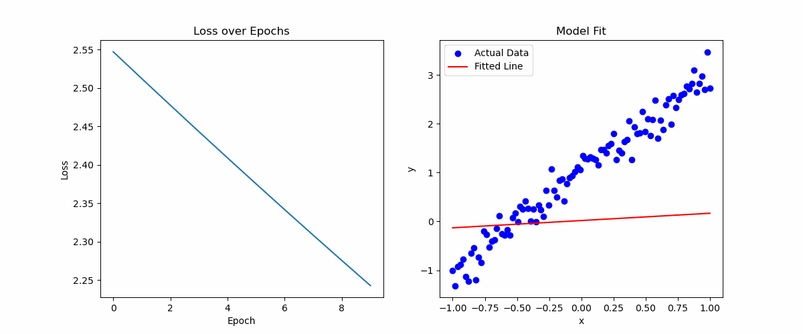
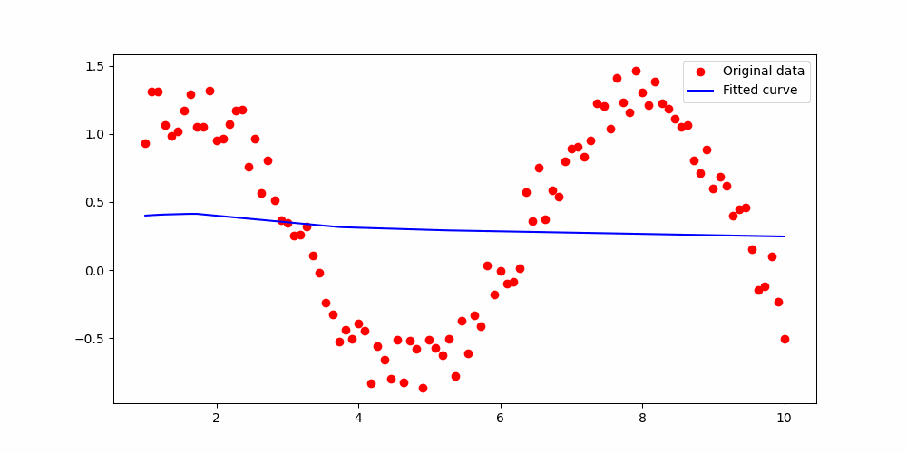
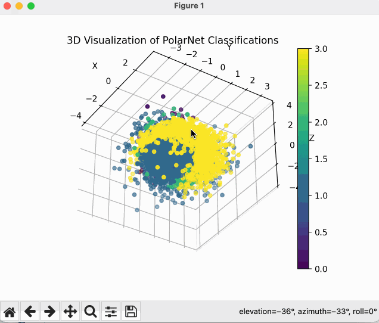
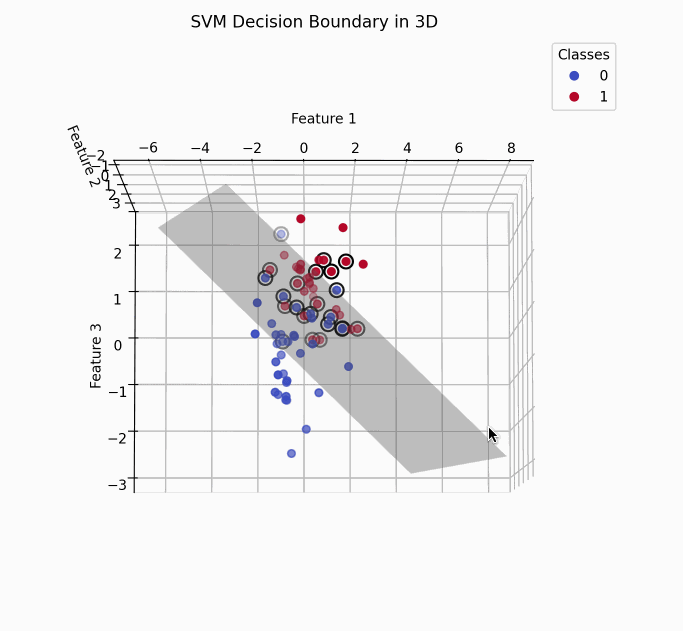
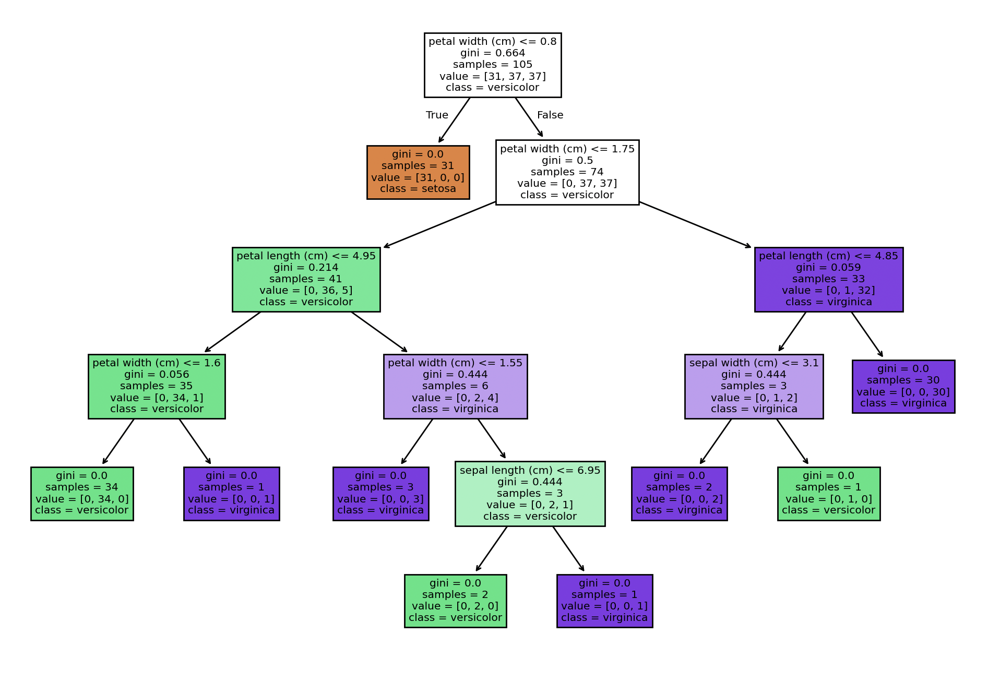
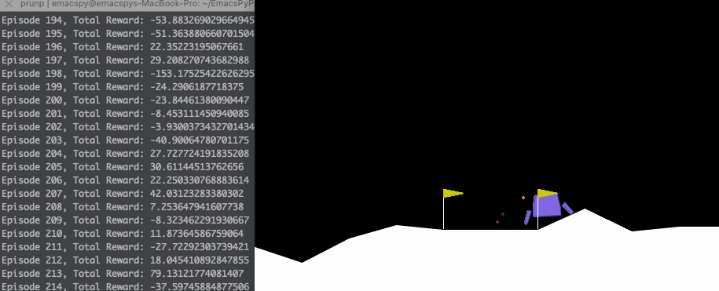
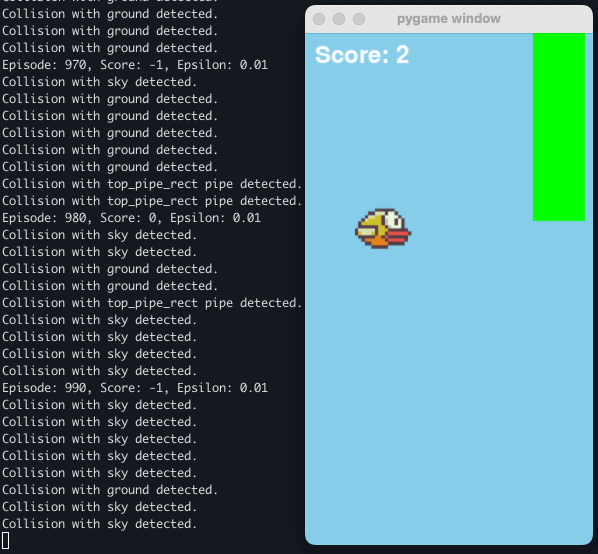
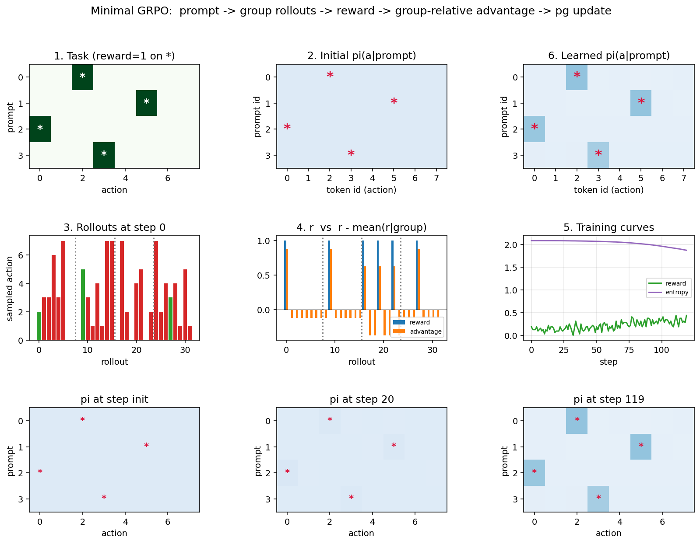
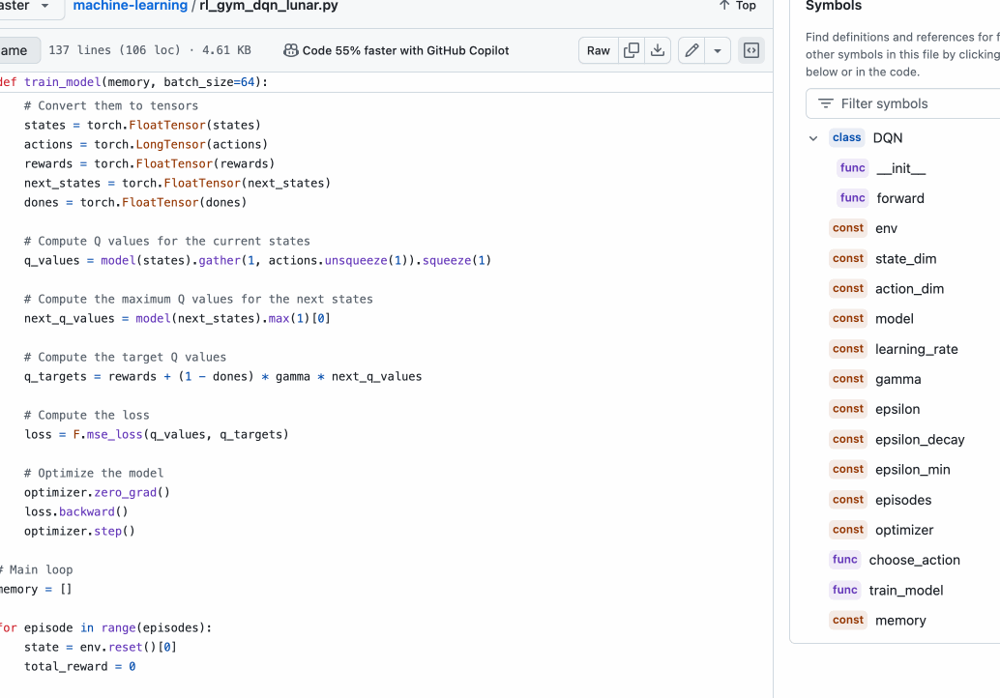

# 可视化 Python 机器学习、深度学习与强化学习

> 本文是 [README.md](./README.md) 的中文版本，并在原文基础上补全了缺失说明、修正了若干代码错误（见 [附录：勘误与补充](#附录勘误与补充)）。

## 第一性原理（First Principle）

* 从大量数据中寻找相同的概率分布，并基于这个分布做出预测：`y = f(x)`。
* 就像学习一种函数关系一样，"反函数"或"逆向工程"这类任务需要深度学习来完成——你只知道数据存在某种规律，然后通过训练去猜测生成这些数据的原始函数是什么。比如可以训练出一个"计算器神经网络"。
* 高维空间思想：把代码（或任意序列）切分后投射到高维空间，再在高维空间做非常精细的分类切分；搜索同样也是在高维空间完成的。例如代码可以被 tree-sitter 切分为语法结构后再进行高维训练，从而学到逻辑关系。NLP 的大多数任务本质上都是高维空间中的多分类问题。
* 收集身边能获取到的输入 `x` 和输出 `y` 作为训练数据，随时去挖掘它们的映射关系 `f(x)`。你可以用 GPT 生成自定义数据，或者写爬虫去获取你需要的数据。

## 目录

- [初始化环境](#初始化环境)
- [Python 机器学习](#python-机器学习)
  - [最小二乘法](#最小二乘法)
  - [神经网络实现最小二乘法](#神经网络实现最小二乘法)
  - [非线性拟合](#非线性拟合)
  - [极坐标分类](#极坐标分类)
  - [MNIST 手写数字识别](#mnist-手写数字识别)
  - [使用已训练的 MNIST 模型](#使用已训练的-mnist-模型)
  - [计算器神经网络](#计算器神经网络)
  - [数据清洗](#数据清洗)
  - [SVM](#svm)
  - [KMeans](#kmeans)
  - [决策树分类器](#决策树分类器)
  - [强化学习（DQN）](#强化学习dqn)
  - [Flappy Bird DQN](#flappy-bird-dqn)
  - [GRPO 最小示例](#grpo-最小示例)
  - [DQN vs GRPO —— 同一 RL 核心，不同的假设](#dqn-vs-grpo--同一-rl-核心不同的假设)
  - [SGD](#sgd)
  - [带注意力的 CNN](#带注意力的-cnn)
  - [LSTM 文本生成](#lstm-文本生成)
  - [Seq2Seq 数字翻译器](#seq2seq-数字翻译器)
  - [Transformer 文本生成](#transformer-文本生成)
- [附录：勘误与补充](#附录勘误与补充)

---

## 初始化环境

```bash
conda create -n emacspy python=3.11
conda activate emacspy
poetry install
```

> **补充**：本项目使用 Poetry 管理依赖，核心依赖包括 `torch ^2.2.2`、`torchvision ^0.17.2`、`gymnasium ^0.29.1`（带 `classic-control` 和 `box2d`）、`scikit-learn`、`matplotlib` 等。详情见 `pyproject.toml`。
> 若不使用 poetry，也可以直接：`pip install torch torchvision gymnasium[box2d] scikit-learn matplotlib numpy`。

---

## 最小二乘法

直接用 Normal Equation 求解线性回归的闭式解 `θ = (XᵀX)⁻¹ Xᵀy`。

```python
import numpy as np
import matplotlib.pyplot as plt

# 示例数据
X = np.array([1, 2.2, 3, 4, 5])
y = np.array([2, 4, 6.3, 8, 11])

# 给 X 加一列 1，代表截距项（bias）
X_b = np.c_[np.ones((X.shape[0], 1)), X]

# 通过 Normal Equation 计算最佳拟合参数
theta_best = np.linalg.inv(X_b.T.dot(X_b)).dot(X_b.T).dot(y)

print(f"Intercept: {theta_best[0]}")
print(f"Slope: {theta_best[1]}")

# 基于模型进行预测
y_pred = X_b.dot(theta_best)

plt.scatter(X, y, color='blue', label='Data points')
plt.plot(X, y_pred, color='red', label='Best fit line')
plt.xlabel('X'); plt.ylabel('y'); plt.legend()
plt.show()
```

---

## 神经网络实现最小二乘法

用 PyTorch 的单层线性网络 `nn.Linear(1, 1)` + Adam 优化器拟合 `y = 2x + 1 + 噪声`，等价于前一节的最小二乘法。



```python
import torch
import torch.nn as nn
import torch.optim as optim
import matplotlib.pyplot as plt

# 可视化 torch.optim.Adam 的工作过程

class LinearModel(nn.Module):
    def __init__(self):
        super(LinearModel, self).__init__()
        self.linear = nn.Linear(1, 1)

    def forward(self, x):
        return self.linear(x)

model = LinearModel()
criterion = nn.MSELoss()
optimizer = optim.Adam(model.parameters(), lr=0.01)

# 合成数据：y = 2x + 1 + 噪声
x_train = torch.linspace(-1, 1, 100).reshape(-1, 1)
y_train = 2 * x_train + 1 + 0.2 * torch.randn(x_train.size())

loss_values = []

for epoch in range(1000):
    model.train()
    optimizer.zero_grad()
    outputs = model(x_train)
    loss = criterion(outputs, y_train)
    loss.backward()
    optimizer.step()
    loss_values.append(loss.item())
```

> **补充**：训练完成后 `model.linear.weight` 应趋近于 2，`model.linear.bias` 应趋近于 1。这是理解"神经网络就是可学习参数的函数逼近器"最简洁的例子。

---

## 非线性拟合

用一个三层 MLP 去拟合 `sin(x) + 噪声`。这是最常用的"神经网络能拟合非线性函数"的演示。



```python
import torch
import torch.nn as nn
import numpy as np
import matplotlib.pyplot as plt

# Step 1: 生成长度为 100 的带噪声数据
n = 100
x = torch.linspace(1, 10, n).unsqueeze(1)
y = torch.sin(x) + torch.rand(n, 1) * 0.5

# Step 2: 定义用于非线性拟合的小型神经网络
class NonlinearModel(nn.Module):
    def __init__(self):
        super(NonlinearModel, self).__init__()
        self.fc1 = nn.Linear(1, 10)
        self.fc2 = nn.Linear(10, 10)
        self.fc3 = nn.Linear(10, 1)

    def forward(self, x):
        x = torch.relu(self.fc1(x))
        x = torch.relu(self.fc2(x))
        x = self.fc3(x)
        return x

model = NonlinearModel()

# Step 3: 损失函数与优化器
criterion = nn.MSELoss()
optimizer = torch.optim.Adam(model.parameters(), lr=0.01)

# Step 4: 训练
epochs = 1000
for epoch in range(epochs):
    model.train()
    outputs = model(x)
    loss = criterion(outputs, y)

    optimizer.zero_grad()
    loss.backward()
    optimizer.step()

    if (epoch+1) % 100 == 0:
        print(f'Epoch [{epoch+1}/{epochs}], Loss: {loss.item():.4f}')

# Step 5: 画出原始数据点与拟合曲线
model.eval()
with torch.no_grad():
    predicted = model(x).numpy()

plt.figure(figsize=(10, 5))
plt.plot(x.numpy(), y.numpy(), 'ro', label='Original data')
plt.plot(x.numpy(), predicted, 'b-', label='Fitted curve')
plt.legend()
plt.show()
```

> **勘误**：原 README 中引用了 `2013_nonlinear_fitting.png`，该图片在仓库中不存在；实际可看动图 `training_process.gif`。

---

## 极坐标分类

把三维笛卡尔坐标 `(x, y, z)` 转成球坐标 `(r, θ, φ)`，再用一个小 MLP 做 4 分类。



```python
import torch
import torch.nn as nn
import torch.optim as optim
from torch.utils.data import DataLoader, TensorDataset
import matplotlib.pyplot as plt
from mpl_toolkits.mplot3d import Axes3D

# 笛卡尔坐标 → 球坐标
def cartesian_to_polar(x, y, z):
    r = torch.sqrt(x**2 + y**2 + z**2)
    theta = torch.atan2(y, x)
    phi = torch.acos(z / r)
    return r, theta, phi

# 示例数据生成（实际使用时请替换）
n_samples = 5000
x = torch.randn(n_samples)
y = torch.randn(n_samples)
z = torch.randn(n_samples)
labels = torch.randint(0, 4, (n_samples,))  # 4 类 (0, 1, 2, 3)

r, theta, phi = cartesian_to_polar(x, y, z)
data = torch.stack((r, theta, phi), dim=1)

dataset = TensorDataset(data, labels)
train_loader = DataLoader(dataset, batch_size=32, shuffle=True)

class PolarNet(nn.Module):
    def __init__(self):
        super(PolarNet, self).__init__()
        self.fc1 = nn.Linear(3, 64)
        self.fc2 = nn.Linear(64, 128)
        self.fc3 = nn.Linear(128, 4)  # 4 个输出类别

    def forward(self, x):
        x = torch.relu(self.fc1(x))
        x = torch.relu(self.fc2(x))
        x = self.fc3(x)
        return x

model = PolarNet()
criterion = nn.CrossEntropyLoss()
optimizer = optim.Adam(model.parameters(), lr=0.001)

for epoch in range(20):
    for inputs, targets in train_loader:
        outputs = model(inputs)
        loss = criterion(outputs, targets)
        optimizer.zero_grad()
        loss.backward()
        optimizer.step()
    print(f'Epoch {epoch+1}/20, Loss: {loss.item()}')

# 训练完成后在全量数据上做预测并可视化
with torch.no_grad():
    predicted_labels = model(data).argmax(dim=1)

fig = plt.figure()
ax = fig.add_subplot(111, projection='3d')

# 再转回笛卡尔坐标用于绘图
x_cartesian = r * torch.sin(phi) * torch.cos(theta)
y_cartesian = r * torch.sin(phi) * torch.sin(theta)
z_cartesian = r * torch.cos(phi)

scatter = ax.scatter(x_cartesian, y_cartesian, z_cartesian,
                     c=predicted_labels, cmap='viridis', marker='o')
plt.colorbar(scatter, ax=ax)
ax.set_xlabel('X'); ax.set_ylabel('Y'); ax.set_zlabel('Z')
plt.title('3D Visualization of PolarNet Classifications')
plt.show()
```

> **说明**：因为标签是随机生成的，损失并不会收敛到很低——这个例子演示的是"特征空间变换 + 神经网络分类"的工作流，不是一个真实的分类问题。

---

## MNIST 手写数字识别

经典的三层全连接 MLP 识别手写数字。

```python
import torch
import torch.nn as nn
import torch.optim as optim
import torch.nn.functional as F
from torchvision import datasets, transforms
from torch.utils.data import DataLoader

batch_size = 64
learning_rate = 0.01
epochs = 100
transform = transforms.Compose([
    transforms.ToTensor(),
    transforms.Normalize((0.1307,), (0.3081,))
])
train_dataset = datasets.MNIST(root='./data', train=True, download=True, transform=transform)
test_dataset  = datasets.MNIST(root='./data', train=False, download=True, transform=transform)
train_loader  = DataLoader(dataset=train_dataset, batch_size=batch_size, shuffle=True)
test_loader   = DataLoader(dataset=test_dataset,  batch_size=batch_size, shuffle=False)

class Net(nn.Module):
    def __init__(self):
        super(Net, self).__init__()
        self.fc1 = nn.Linear(28 * 28, 128)
        self.fc2 = nn.Linear(128, 64)
        self.fc3 = nn.Linear(64, 10)

    def forward(self, x):
        x = x.view(-1, 28 * 28)
        x = F.relu(self.fc1(x))
        x = F.relu(self.fc2(x))
        x = self.fc3(x)
        return x

model = Net()
criterion = nn.CrossEntropyLoss()
optimizer = optim.SGD(model.parameters(), lr=learning_rate)

for epoch in range(epochs):
    model.train()
    for batch_idx, (data, target) in enumerate(train_loader):
        optimizer.zero_grad()
        output = model(data)
        loss = criterion(output, target)
        loss.backward()
        optimizer.step()
        if batch_idx % 100 == 0:
            print(f'Epoch: {epoch+1}/{epochs} '
                  f'[Batch: {batch_idx*len(data)}/{len(train_loader.dataset)}] '
                  f'Loss: {loss.item():.6f}')

# 测试
model.eval()
test_loss = 0
correct = 0
with torch.no_grad():
    for data, target in test_loader:
        output = model(data)
        test_loss += criterion(output, target).item()
        pred = output.argmax(dim=1, keepdim=True)
        correct += pred.eq(target.view_as(pred)).sum().item()

test_loss /= len(test_loader.dataset)
accuracy = 100. * correct / len(test_loader.dataset)
print(f'Test set: Average loss: {test_loss:.4f}, '
      f'Accuracy: {correct}/{len(test_loader.dataset)} ({accuracy:.2f}%)')
torch.save(model.state_dict(), "mnist_model.pth")
```

> **补充**：`(0.1307,)` 与 `(0.3081,)` 是 MNIST 整个训练集像素的均值与标准差，是该数据集的常用标准化参数。

---

## 使用已训练的 MNIST 模型

加载上一节保存的 `mnist_model.pth`，对一张手写数字图片做推理。

```python
from PIL import Image  # 原代码遗漏了这个 import
from torchvision import transforms
import torch

model = Net()
# 加载已训练权重
model.load_state_dict(torch.load("mnist_model.pth"))
model.eval()  # 切换到评估模式

# 预处理：转为灰度、缩放到 28x28、归一化
def preprocess_image(image_path):
    transform = transforms.Compose([
        transforms.Grayscale(),
        transforms.Resize((28, 28)),
        transforms.ToTensor(),
        transforms.Normalize((0.1307,), (0.3081,))
    ])
    image = Image.open(image_path)
    image = transform(image).unsqueeze(0)  # 加上 batch 维度
    return image

# 推理
def recognize_digit(image_path):
    image = preprocess_image(image_path)
    with torch.no_grad():
        output = model(image)
        prediction = output.argmax(dim=1, keepdim=True)
    return prediction.item()

# 使用示例
image_path = 'path_to_your_handwritten_digit_image3.png'
predicted_digit = recognize_digit(image_path)
print(f'Predicted Digit: {predicted_digit}')
```

> **勘误**：原 README 中未 `import Image`，直接运行会报 `NameError`。上面已补全 `from PIL import Image`。

---

## 计算器神经网络

用一个 MLP 去"反向学习"四则运算：输入 `[a, b, op_id]`，输出 `a op b` 的结果。这是"逆向工程函数"的经典示例。

```python
import torch
import torch.nn as nn
import torch.optim as optim
import random
import numpy as np

class CalculatorNN(nn.Module):
    def __init__(self):
        super(CalculatorNN, self).__init__()
        self.fc1 = nn.Linear(3, 128)  # 输入：2 个数 + 1 个操作符 id
        self.fc2 = nn.Linear(128, 64)
        self.fc3 = nn.Linear(64, 1)   # 输出：运算结果

    def forward(self, x):
        x = torch.relu(self.fc1(x))
        x = torch.relu(self.fc2(x))
        x = self.fc3(x)
        return x

model = CalculatorNN()
criterion = nn.MSELoss()
optimizer = optim.Adam(model.parameters(), lr=0.001)

# 训练
num_epochs = 50000  # 如果只训练 5000 轮，loss 会非常大
for epoch in range(num_epochs):
    model.train()
    predictions = model(X_train)        # 需要先自己准备 X_train, y_train
    loss = criterion(predictions, y_train)
    optimizer.zero_grad()
    loss.backward()
    optimizer.step()
    if (epoch + 1) % 10 == 0:
        print(f'Epoch [{epoch+1}/{num_epochs}], Loss: {loss.item():.4f}')

# 保存（原 README 遗漏了这一步）
torch.save(model.state_dict(), 'calculator_model.pth')

# ---- 使用已训练模型
model = CalculatorNN()
model.load_state_dict(torch.load('calculator_model.pth'))
model.eval()

with torch.no_grad():
    # 输入 [32.0, 3.0, 2]，其中 2 代表乘法
    input_data = torch.tensor([[32.0, 3.0, 2]], dtype=torch.float32)
    prediction = model(input_data)
    print(f'Prediction for 32 * 3: {prediction.item():.4f}')
```

> **勘误 / 补充**：
> 1. 原 README 中 `X_train`、`y_train` 未给出构造方式。典型做法是：随机生成成对的 `(a, b)`，op_id 用 0/1/2/3 分别代表 `+−×÷`，然后自己用 Python 计算 label。建议对输入/输出做归一化，否则神经网络很难拟合大范围实数。
> 2. 原 README 中只有 `load_state_dict` 而没有 `torch.save`，这里补上保存步骤。
> 3. 用 MLP 学习精确算术本身是一个 hard task，即使训练很久 loss 也难以降到 0，这属于正常现象——这是一个"原理演示"而非"实用计算器"。

---

## 数据清洗

* [log clean utils](./log_utils.py)

```python
## 按模式切分日志文件
def split_log_file(input_file, split_pattern, output_pattern):
    with open(input_file, 'r') as file:
        log_content = file.read()
    pattern = re.compile(split_pattern)
    split_points = [match.start() for match in re.finditer(pattern, log_content)]
    split_points.append(len(log_content))
    for i in range(len(split_points) - 1):
        start = split_points[i]
        end = split_points[i + 1]
        segment = log_content[start:end]
        match = pattern.search(segment)
        if match:
            number = match.group(1)
            output_file = output_pattern.format(number=number)
            with open(output_file, 'w') as file:
                file.write(segment)
            print(f"Segment saved as {output_file}")

## 按不同模式把日志归档到不同目录
def move_patterns_logs(destination_path, patterns):
    current_directory = os.getcwd()
    log_files = glob.glob("*.log")
    for log_file in log_files:
        with open(log_file, 'r') as file:
            if any(re.search(pattern, line) for pattern in patterns for line in file):
                shutil.move(os.path.join(current_directory, log_file), destination_path)
                break

## 过滤显示 / 数据可视化用的筛选器
def filter_log_file(log_file_path, exclude_keywords):
    with open(log_file_path, "r") as file:
        lines = file.readlines()
    filtered_lines = [line for line in lines
                      if not any(keyword in line for keyword in exclude_keywords)]
    for line in filtered_lines:
        print(line, end="")
```

> **补充**：上述片段用到了 `re`、`os`、`glob`、`shutil`，完整可运行版请参见 [`log_utils.py`](./log_utils.py)。

---

## SVM

用 `sklearn.svm.SVC(kernel='linear')` 做 3D 特征的二分类，并把决策超平面绘制在 3D 空间中。



```python
import numpy as np
import matplotlib.pyplot as plt
from mpl_toolkits.mplot3d import Axes3D
from sklearn.datasets import make_classification
from sklearn.svm import SVC
from sklearn.preprocessing import StandardScaler
from sklearn.model_selection import train_test_split

X, y = make_classification(n_samples=100, n_features=3, n_informative=3,
                           n_redundant=0, n_classes=2, random_state=42)
X_train, X_test, y_train, y_test = train_test_split(X, y, test_size=0.3, random_state=42)
scaler = StandardScaler()
X_train = scaler.fit_transform(X_train)
X_test  = scaler.transform(X_test)
model = SVC(kernel='linear')
model.fit(X_train, y_train)

def plot_svm_decision_boundary_3d(model, X, y):
    fig = plt.figure(figsize=(10, 8))
    ax = fig.add_subplot(111, projection='3d')
    scatter = ax.scatter(X[:, 0], X[:, 1], X[:, 2], c=y, s=30, cmap=plt.cm.coolwarm)
    xlim = ax.get_xlim(); ylim = ax.get_ylim(); zlim = ax.get_zlim()
    xx = np.linspace(xlim[0], xlim[1], 20)
    yy = np.linspace(ylim[0], ylim[1], 20)
    zz = np.linspace(zlim[0], zlim[1], 20)
    YY, ZZ = np.meshgrid(yy, zz)
    # 由 w·x + b = 0 推出决策平面的 X 坐标
    XX = -(model.coef_[0][0] * YY + model.coef_[0][2] * ZZ + model.intercept_) / model.coef_[0][1]
    ax.plot_surface(XX, YY, ZZ, color='gray', alpha=0.3, rstride=100, cstride=100)
    ax.scatter(model.support_vectors_[:, 0], model.support_vectors_[:, 1], model.support_vectors_[:, 2],
               s=100, facecolors='none', edgecolors='k', linewidth=1.5, label='Support Vectors')
    ax.set_title('SVM Decision Boundary in 3D')
    ax.set_xlabel('Feature 1'); ax.set_ylabel('Feature 2'); ax.set_zlabel('Feature 3')
    legend1 = ax.legend(*scatter.legend_elements(), loc="best", title="Classes")
    ax.add_artist(legend1)
    plt.show()

plot_svm_decision_boundary_3d(model, X_train, y_train)
```

---

## KMeans

* [kmeans log analysis](./kmeans_log_analysis.py)

用 TF-IDF 把错误日志转向量，再用 KMeans 聚类，便于快速发现日志中的"同类问题"。

```python
from sklearn.feature_extraction.text import TfidfVectorizer
from sklearn.cluster import KMeans

def cluster_error_messages(error_messages, num_clusters=5):
    vectorizer = TfidfVectorizer(stop_words='english')
    X = vectorizer.fit_transform(error_messages)

    kmeans = KMeans(n_clusters=num_clusters, random_state=0)
    kmeans.fit(X)

    labels = kmeans.labels_
    clustered_errors = {}
    for i, label in enumerate(labels):
        if label not in clustered_errors:
            clustered_errors[label] = []
        clustered_errors[label].append(error_messages[i])
    return clustered_errors
```

---

## 决策树分类器

用 `sklearn.tree.DecisionTreeClassifier` 在经典鸢尾花数据集上做 3 分类，并用 `plot_tree` 把决策树画出来。



```python
import matplotlib.pyplot as plt
from sklearn.datasets import load_iris
from sklearn.model_selection import train_test_split
from sklearn.tree import DecisionTreeClassifier, plot_tree
from sklearn import metrics

iris = load_iris()
X = iris.data     # 特征
y = iris.target   # 标签
X_train, X_test, y_train, y_test = train_test_split(X, y, test_size=0.3, random_state=42)
clf = DecisionTreeClassifier()
clf.fit(X_train, y_train)
y_pred = clf.predict(X_test)
accuracy = metrics.accuracy_score(y_test, y_pred)
print(f"Accuracy: {accuracy * 100:.2f}%")
plt.figure(figsize=(12, 8))
plot_tree(clf, feature_names=iris.feature_names, class_names=iris.target_names, filled=True)
plt.show()
```

---

## 强化学习（DQN）

用 DQN 玩 gymnasium 的 `LunarLander-v2`。DQN 的核心思路：用神经网络拟合 `Q(s,a)`，用 ε-贪婪策略采样，用贝尔曼方程作为目标。



```python
import torch
import torch.nn as nn
import torch.optim as optim
import torch.nn.functional as F
import numpy as np
import random

# 简单的全连接 Q 网络
class DQN(nn.Module):
    def __init__(self, input_dim, output_dim):
        super(DQN, self).__init__()
        self.fc1 = nn.Linear(input_dim, 128)
        self.fc2 = nn.Linear(128, 128)
        self.fc3 = nn.Linear(128, output_dim)

    def forward(self, x):
        x = F.relu(self.fc1(x))
        x = F.relu(self.fc2(x))
        return self.fc3(x)

# 初始化环境与模型
import gymnasium as gym

env = gym.make("LunarLander-v2", render_mode="human")
state_dim  = env.observation_space.shape[0]
action_dim = env.action_space.n

model = DQN(input_dim=state_dim, output_dim=action_dim)

# 训练超参数
learning_rate = 0.001
gamma         = 0.99    # 折扣因子
epsilon       = 1.0     # 探索率
epsilon_decay = 0.995
epsilon_min   = 0.01
episodes      = 500

optimizer = optim.Adam(model.parameters(), lr=learning_rate)

# ε-贪婪策略选择动作
def choose_action(state, epsilon):
    if np.random.rand() <= epsilon:
        return np.random.choice(action_dim)  # 随机探索
    state = torch.FloatTensor(state).unsqueeze(0)
    with torch.no_grad():
        q_values = model(state)
    return torch.argmax(q_values).item()

def train_model(memory, batch_size=64):
    if len(memory) < batch_size:
        return

    batch = random.sample(memory, batch_size)
    states, actions, rewards, next_states, dones = zip(*batch)

    states      = torch.FloatTensor(np.array(states))
    actions     = torch.LongTensor(actions)
    rewards     = torch.FloatTensor(rewards)
    next_states = torch.FloatTensor(np.array(next_states))
    dones       = torch.FloatTensor(dones)

    # 当前 Q 值
    q_values      = model(states).gather(1, actions.unsqueeze(1)).squeeze(1)
    # 下一状态的最大 Q（Target Q）
    next_q_values = model(next_states).max(1)[0]
    # Bellman 目标
    q_targets     = rewards + (1 - dones) * gamma * next_q_values

    loss = F.mse_loss(q_values, q_targets)
    optimizer.zero_grad()
    loss.backward()
    optimizer.step()

# 主循环
memory = []
for episode in range(episodes):
    state = env.reset()[0]
    total_reward = 0
    for t in range(1000):
        action = choose_action(state, epsilon)
        next_state, reward, done, truncated, _ = env.step(action)
        memory.append((state, action, reward, next_state, done))
        train_model(memory)
        state = next_state
        total_reward += reward
        if done or truncated:
            break
    epsilon = max(epsilon_min, epsilon * epsilon_decay)
    print(f"Episode {episode + 1}, Total Reward: {total_reward}")

env.close()
```

> **补充 / 勘误**：
> 1. 原 README 版本直接 `torch.FloatTensor(states)`，在部分 numpy 版本下会触发 "Creating a tensor from a list of numpy.ndarrays is extremely slow" 警告。推荐先 `np.array(states)` 再转 Tensor，上面已修正。
> 2. 这是"纯 DQN"的最简版本；生产级 DQN 还需要 **Target Network、经验回放 buffer**（`collections.deque(maxlen=...)` 而不是无界 `list`）、**Double DQN** 等技巧。

---

## Flappy Bird DQN

在自定义的 Gym 环境 `FlappyBirdEnv` 上训练 DQN Agent（不使用 CNN，直接用状态向量）。



```python
import gymnasium as gym
import numpy as np
import pygame
from gymnasium import spaces
import torch
import torch.nn as nn
import torch.optim as optim
import random
from collections import deque
import time

from flappy_bird_cl3_pass_env_to_nn_3 import FlappyBirdEnv

class DQN(nn.Module):
    def __init__(self, input_size, n_actions):
        super(DQN, self).__init__()
        self.fc = nn.Sequential(
            nn.Linear(input_size, 64),
            nn.ReLU(),
            nn.Linear(64, 64),
            nn.ReLU(),
            nn.Linear(64, n_actions)
        )

    def forward(self, x):
        return self.fc(x)

class DQNAgent:
    def __init__(self, env, learning_rate=1e-3, gamma=0.99,
                 epsilon_start=1.0, epsilon_final=0.01, epsilon_decay=0.995):
        self.env = env
        self.n_actions = env.action_space.n
        self.device = torch.device("cuda" if torch.cuda.is_available() else "cpu")

        self.epsilon       = epsilon_start
        self.epsilon_final = epsilon_final
        self.epsilon_decay = epsilon_decay

        self.memory = deque(maxlen=10000)   # 有上限的经验回放 buffer
        self.batch_size = 64

        state_size = len(env.get_state())
        self.model     = DQN(state_size, self.n_actions).to(self.device)
        self.optimizer = optim.Adam(self.model.parameters(), lr=learning_rate)
        self.criterion = nn.MSELoss()
        self.gamma     = gamma

    def get_action(self, state):
        if random.random() < self.epsilon:
            return random.randint(0, self.n_actions - 1)
        with torch.no_grad():
            state = torch.FloatTensor(state).unsqueeze(0).to(self.device)
            q_values = self.model(state)
            return torch.argmax(q_values).item()

    def update_epsilon(self):
        self.epsilon = max(self.epsilon_final, self.epsilon * self.epsilon_decay)

    def remember(self, state, action, reward, next_state, done):
        self.memory.append((state, action, reward, next_state, done))

    def train(self):
        if len(self.memory) < self.batch_size:
            return
        batch = random.sample(self.memory, self.batch_size)
        states, actions, rewards, next_states, dones = zip(*batch)

        states      = torch.FloatTensor(np.array(states)).to(self.device)
        actions     = torch.LongTensor(actions).to(self.device)
        rewards     = torch.FloatTensor(rewards).to(self.device)
        next_states = torch.FloatTensor(np.array(next_states)).to(self.device)
        dones       = torch.FloatTensor(dones).to(self.device)

        current_q_values = self.model(states).gather(1, actions.unsqueeze(1))
        with torch.no_grad():
            next_q_values = self.model(next_states).max(1)[0]
        target_q_values = rewards + (1 - dones) * self.gamma * next_q_values

        loss = self.criterion(current_q_values.squeeze(), target_q_values)
        self.optimizer.zero_grad()
        loss.backward()
        self.optimizer.step()

def train_dqn(env, episodes=2000, max_steps=1000, render_interval=10):
    agent = DQNAgent(env)
    scores = []
    for episode in range(episodes):
        state = env.reset()
        score = 0
        for step in range(max_steps):
            if episode % render_interval == 0:
                env.render()
            action = agent.get_action(state)
            next_state, reward, done, _, _ = env.step(action)
            agent.remember(state, action, reward, next_state, done)
            agent.train()
            state  = next_state
            score += reward
            if done:
                break
            if episode % render_interval == 0:
                pygame.event.pump()
        agent.update_epsilon()
        scores.append(score)
        if episode % 10 == 0:
            print(f"Episode: {episode}, Score: {score}, Epsilon: {agent.epsilon:.2f}")
    return agent, scores

if __name__ == "__main__":
    env = FlappyBirdEnv()
    agent, scores = train_dqn(env, episodes=6000, render_interval=50)

    # 测试训练好的 Agent
    state = env.reset()
    done = False
    score = 0
    while not done:
        env.render()
        action = agent.get_action(state)
        next_state, reward, done, _, _ = env.step(action)
        state  = next_state
        score += reward
        for event in pygame.event.get():
            if event.type == pygame.QUIT:
                done = True
        pygame.event.pump()
        time.sleep(0.03)
    print(f"Final Score: {score}")
    env.close()
```

> **补充**：相比前面的 LunarLander DQN，这里的关键改进是：① 使用 `deque(maxlen=10000)` 作为经验回放；② `env.get_state()` 返回向量化状态（无需 CNN）；③ 把模型放到 CUDA 上。

---

## GRPO 最小示例

`grpo_minimal.py` 是一个最小可运行的 **GRPO（Group Relative Policy Optimization）** 训练循环，其结构模仿配套项目 `MathGPT/scripts/train_rl.py`（在 GSM8K 数学题上用 LLM 跑 GRPO）。

为了避免依赖大模型，这里的"环境"是一个 contextual bandit：4 个 prompt、词表大小 8，当采样到 prompt 对应的"秘密目标 token"时 reward = 1，否则 = 0。策略就是一张 `[num_prompts, vocab]` 的 logit 表——能有"策略梯度"的最小结构。

完整流程（与 MathGPT `train_rl.py` 一致）：

1. 对每个 prompt，从 `π(a|prompt)` 采样 **G 个 rollouts**（即"一组"）。
2. 用 reward 函数给每条 rollout 打分（1.0 / 0.0）。
3. **优势 = reward − 组均值**（`train_rl.py:158` 中的 `advantages = rewards - rewards.mean()`）。
4. 策略梯度损失：`−E[ log π(a|s) · A ]`（`train_rl.py:254-258`）。
5. 梯度下降；重复。

```python
def grpo_step():
    prompts = torch.arange(NUM_PROMPTS).repeat_interleave(NUM_SAMPLES)
    logits  = policy(prompts)
    dist    = torch.distributions.Categorical(logits=logits)
    actions = dist.sample()
    logp    = dist.log_prob(actions)

    rewards = reward_fn(prompts, actions)

    # 组相对优势：每个 prompt 一个 baseline
    rewards_by_group = rewards.view(NUM_PROMPTS, NUM_SAMPLES)
    baseline         = rewards_by_group.mean(dim=1, keepdim=True)
    advantages       = (rewards_by_group - baseline).view(-1)

    loss = -(logp * advantages.detach()).mean()
    optimizer.zero_grad(); loss.backward(); optimizer.step()
```

脚本运行完成后会保存对 pipeline 的可视化分解：

| 文件 | 内容 |
|---|---|
| `grpo_01_task.png` | prompt → 正确 token 的映射（奖励地形） |
| `grpo_02_policy_init.png` | 训练前的 `π(a\|prompt)`——均匀分布 |
| `grpo_03_rollouts.png` | 一批组采样，按 reward 着色 |
| `grpo_04_advantages.png` | reward vs. `reward − 组均值`（降方差的 baseline） |
| `grpo_05_training_curves.png` | 训练过程中的 mean reward、pg loss、policy entropy |
| `grpo_06_policy_final.png` | 学到的 `π(a\|prompt)`——概率都集中到正确 token |
| `grpo_06b_policy_evolution.png` | π 逐步迁移到正确 token 的快照 |
| `grpo_overview.png` | 以上所有图的合集 |

运行：

```bash
python grpo_minimal.py
```

> **补充**：`grpo_*.png` 这些图不是预先放在仓库里的，而是在你第一次运行 `python grpo_minimal.py` 后才会生成。

---

## DQN vs GRPO —— 同一 RL 核心，不同的假设

上面的 DQN 示例（`rl_games/rl_gym_dqn_lunar.py`、`rl_games/flappy_bird_app/...`）和 GRPO 示例（`grpo_minimal.py`，映射自 `MathGPT/scripts/train_rl.py`）**都是强化学习**。它们看起来很不一样，只是因为面向的环境差异太大（Atari / Gym 游戏 vs. LLM 答数学题），但底层的循环结构是一致的。

### 相同的部分（RL 的本质）

两者做的其实是同一件事：

1. **交互**：和某个东西交互——DQN 是 Gym 环境，GRPO 是 LLM 自己的生成器——收集 `(situation, action, reward)` 数据。
2. **信用分配**：对每个动作估计它实际的好坏。
3. **让神经网络去"推一把"**：使那些"事后证明不错"的动作下次更容易被选中。
4. **重复**，直到期望 reward 不再上升。

两者都在优化同一个目标：`max_θ E_{τ~π_θ} [R(τ)]`。都需要探索、都用神经网络做函数逼近、都需要做一些方差缩减（因为 reward 信号噪声很大），也都会遇到 sample efficiency 和 credit assignment 的老问题。

### 不同的部分

真正有意思的问题是：每个算法在**哪里**做了不同的结构性选择，**为什么**——环境决定了算法。

| 维度 | DQN（游戏，本项目的 `rl_games/`） | GRPO（推理/问答，`grpo_minimal.py` ↔ `MathGPT`） |
|---|---|---|
| **算法家族** | 基于值函数（Q-learning） | 基于策略梯度（REINFORCE with baseline） |
| **神经网络输出** | `Q(s, a)`——动作价值估计 | `π(a\|s)`——直接输出一个概率分布 |
| **策略怎么来** | `argmax_a Q(s,a)` + ε-greedy 噪声 | 从 softmax 采样——网络本身就是策略 |
| **更新规则** | Bellman / TD：`Q(s,a) ← r + γ max_a' Q(s',a')` | PG：`θ ← θ + η · ∇log π(a\|s) · A` |
| **是否靠自估值 bootstrap** | 是——TD target 用到 `Q` 自己（不稳定，需要 target network） | 否——直接用蒙特卡洛 reward |
| **On-policy / off-policy** | Off-policy（回放 buffer 中的老 transition 依然可用） | On-policy（必须每次重新采样——老 rollouts 会过期） |
| **数据复用** | Experience Replay，打散采 minibatch | 每步都是新鲜 rollouts，用完即弃 |
| **探索机制** | 外部注入：ε-greedy、噪声、衰减计划 | 内建：从 π 中随机采样，可选 temperature |
| **方差缩减** | Target network、Double DQN、Huber loss、clip reward | **组相对 baseline**：对同一 prompt 的 N 个 rollout 减去均值 |
| **一次 episode 的形态** | 一长串 `(s_t, a_t, r_t, s_{t+1})`，一回合内很多决策 | 一个 prompt → 一次完整生成；"一条 episode" = 一个序列 |
| **Reward 密度** | 稠密——几乎每步都有 reward | 稀疏——整段生成一个标量（对/错） |
| **折扣 γ** | 是，`γ ∈ [0.9, 0.999]`，对长视野至关重要 | 通常 `γ = 1`（只有终局 reward，折扣无意义） |
| **状态 / 上下文** | 物理向量或像素帧，Markov | Token 前缀（prompt）；状态 = 已生成的所有内容 |
| **动作空间** | 小且离散——CartPole 2 个、LunarLander 4 个、Flappy Bird 2 个 | 巨大——每个 token 位置是一次 vocab 大小的分类（上万） |
| **"一次决策几条 rollouts"** | 每个 env step 1 条，之后从 buffer 批量采 | **每个 prompt G 条**（GRPO 的 Group，MathGPT 中 `--num-samples=16`） |
| **Baseline 来源** | 慢更新的 target network 提供稳定 Q 目标 | 组内 reward 的均值——不需要额外网络 |
| **会怎么坏掉** | Q 值过估、非平稳目标、replay 陈旧 | Reward collapse（entropy → 0）；若复用老 rollouts 则 bias 变大 |
| **典型环境** | Gym / ALE / 物理模拟器 | 一个 base / SFT 语言模型自己生成 rollouts |
| **本仓库对应文件** | `rl_games/rl_gym_dqn_lunar.py`、`rl_games/flappy_bird_app/*`、`drive_torch_dqn_nocnn.py` | `grpo_minimal.py`（及 `MathGPT/scripts/train_rl.py`） |

### 一句话总结

DQN 学的是**每个动作在每个状态下有多好**，然后贪心地选；它在游戏上好用，是因为游戏给的是每步稠密的 reward，而且老经验还能通过 replay 反复利用。GRPO 干脆跳过价值函数：生成一整段答案、查看 reward、跟同一 prompt 下兄弟 rollouts 的 reward 比较，把策略推向"表现更好的兄弟"——它在 LLM 上好用，是因为语言模型可以轻易地对同一个 prompt 批量生成一组 rollouts，而组内均值是一个免费的无偏 baseline。



---

## SGD

把 SGD 的优化轨迹画在一个 3D 损失曲面 `sin(x)cos(y) + 0.1(x² + y²)` 上。



```python
import torch
import numpy as np
import matplotlib.pyplot as plt
from mpl_toolkits.mplot3d import Axes3D
from matplotlib.animation import FuncAnimation

# 损失函数（作为 3D 曲面可视化）
def loss_function(x, y):
    return torch.sin(x) * torch.cos(y) + 0.1 * (x**2 + y**2)

# 生成用于画曲面的网格
x = torch.linspace(-5, 5, 100)
y = torch.linspace(-5, 5, 100)
X, Y = torch.meshgrid(x, y, indexing='ij')   # ← PyTorch 2.x 必须显式传 indexing
Z = loss_function(X, Y).detach().numpy()

fig = plt.figure(figsize=(10, 7))
ax = fig.add_subplot(111, projection='3d')
ax.set_xlabel('X'); ax.set_ylabel('Y'); ax.set_zlabel('Z')
ax.set_title('SGD Optimization Path on 3D Surface')

ax.plot_surface(X.numpy(), Y.numpy(), Z, cmap='viridis', alpha=0.7)

# SGD 起点
start_point = torch.tensor([4.0, 4.0], requires_grad=True)

learning_rate = 0.1
optimizer = torch.optim.SGD([start_point], lr=learning_rate)

steps = 10
path = np.zeros((steps, 3))

point_plot, = ax.plot([], [], [], color='r', marker='o', markersize=5)

def update(i):
    global start_point
    optimizer.zero_grad()
    loss = loss_function(start_point[0], start_point[1])
    loss.backward()
    optimizer.step()

    path[i, 0] = start_point[0].item()
    path[i, 1] = start_point[1].item()
    path[i, 2] = loss.item()

    point_plot.set_data(path[:i+1, 0], path[:i+1, 1])
    point_plot.set_3d_properties(path[:i+1, 2])
    return point_plot,

ani = FuncAnimation(fig, update, frames=steps, interval=500, blit=True)
plt.show()
```

> **勘误**：原 README 中 `torch.meshgrid(x, y)` 没有传 `indexing=` 参数，在 PyTorch ≥ 1.10 会打印警告（并在未来版本默认行为可能变更）。建议显式写 `indexing='ij'`（数学矩阵顺序）或 `'xy'`（可视化顺序）。

---

## 带注意力的 CNN

在 CNN 的中间层加一个简单的通道注意力（channel attention）模块。

```python
import torch
import torch.nn as nn
import torch.nn.functional as F
import torch.optim as optim

class Attention(nn.Module):
    def __init__(self, in_channels, out_channels):
        super(Attention, self).__init__()
        self.conv = nn.Conv2d(in_channels, out_channels, kernel_size=1)
        self.softmax = nn.Softmax(dim=-1)

    def forward(self, x):
        # 全局特征：对空间维求均值（通道级 squeeze）
        global_features = torch.mean(x, dim=(2, 3), keepdim=True)
        attention_map = self.conv(global_features)
        attention_map = self.softmax(attention_map)
        out = x * attention_map
        return out

class CNNWithAttention(nn.Module):
    def __init__(self):
        super(CNNWithAttention, self).__init__()
        # 卷积层
        self.conv1 = nn.Conv2d(3, 32, kernel_size=3, padding=1)
        self.conv2 = nn.Conv2d(32, 64, kernel_size=3, padding=1)
        self.pool  = nn.MaxPool2d(2, 2)
        # 注意力层
        self.attention = Attention(64, 64)
        # 全连接层
        self.fc1 = nn.Linear(64 * 8 * 8, 512)
        self.fc2 = nn.Linear(512, 10)

    def forward(self, x):
        x = self.pool(F.relu(self.conv1(x)))
        x = self.pool(F.relu(self.conv2(x)))
        x = self.attention(x)
        x = x.view(-1, 64 * 8 * 8)
        x = F.relu(self.fc1(x))
        x = self.fc2(x)
        return x

# 初始化模型、损失、优化器
model = CNNWithAttention()
criterion = nn.CrossEntropyLoss()
optimizer = optim.Adam(model.parameters(), lr=0.001)

# 训练循环（需要自己准备 trainloader）
for epoch in range(5):
    running_loss = 0.0
    for inputs, labels in trainloader:
        optimizer.zero_grad()
        outputs = model(inputs)
        loss = criterion(outputs, labels)
        loss.backward()
        optimizer.step()
        running_loss += loss.item()
    print(f"Epoch [{epoch + 1}/5], Loss: {running_loss / len(trainloader)}")
```

> **补充**：这里的 `fc1 = nn.Linear(64 * 8 * 8, 512)` 假设输入图像经过两次 `MaxPool2d(2,2)` 后空间尺寸变为 8×8，因此原始输入图像应为 **32×32**（例如 CIFAR-10）。不同输入尺寸需要调整这一行。

---

## LSTM 文本生成

用 2 层 LSTM 对语料做字符/词级别的序列建模，训练后可以从一个起始词开始逐步采样生成后续文本。

```python
import torch
import torch.nn as nn
import torch.optim as optim
from torch.utils.data import Dataset, DataLoader

class Vocab:
    def __init__(self, stoi, itos):
        self.stoi = stoi
        self.itos = itos

# 语料（这里只给了开头，实际使用时替换成完整文本）
corpus = """
The history of artificial intelligence (AI) began in antiquity, with myths, stories
and rumors of artificial beings endowed with intelligence or consciousness by master craftsmen.
... ...
"""

corpus = corpus.replace("\n", " ")
tokens = corpus.split()

from collections import Counter
token_counts = Counter(tokens)
vocab_stoi = {token: idx for idx, (token, count) in enumerate(token_counts.items())}
vocab_itos = {idx: token for token, idx in vocab_stoi.items()}
vocab = Vocab(stoi=vocab_stoi, itos=vocab_itos)

class RNNModel(nn.Module):
    def __init__(self, vocab_size, embed_size, hidden_size, num_layers):
        super(RNNModel, self).__init__()
        self.num_layers  = num_layers
        self.hidden_size = hidden_size
        self.embedding = nn.Embedding(vocab_size, embed_size)
        self.rnn = nn.LSTM(embed_size, hidden_size, num_layers, batch_first=True)
        self.fc  = nn.Linear(hidden_size, vocab_size)

    def forward(self, x, hidden):
        x = self.embedding(x)
        out, hidden = self.rnn(x, hidden)
        out = self.fc(out)
        return out, hidden

    def init_hidden(self, batch_size):
        weight = next(self.parameters()).data
        return (weight.new_zeros(self.num_layers, batch_size, self.hidden_size),
                weight.new_zeros(self.num_layers, batch_size, self.hidden_size))

class TextDataset(Dataset):
    def __init__(self, text, vocab, sequence_length):
        self.vocab = vocab
        self.sequence_length = sequence_length
        self.data = self.tokenize_and_encode(text)

    def tokenize_and_encode(self, text):
        tokens = text.split()
        return [self.vocab.stoi[token] for token in tokens if token in self.vocab.stoi]

    def __len__(self):
        return len(self.data) - self.sequence_length

    def __getitem__(self, idx):
        x = self.data[idx:idx + self.sequence_length]
        y = self.data[idx + 1:idx + 1 + self.sequence_length]
        return torch.tensor(x, dtype=torch.long), torch.tensor(y, dtype=torch.long)

sequence_length = 10
batch_size = 100

dataset = TextDataset(corpus, vocab, sequence_length)
train_loader = DataLoader(dataset, batch_size=batch_size, shuffle=True)

# 模型、损失、优化器
vocab_size    = len(vocab.stoi)
embed_size    = 50
hidden_size   = 100
num_layers    = 2
num_epochs    = 100
learning_rate = 0.001

model = RNNModel(vocab_size, embed_size, hidden_size, num_layers)
criterion = nn.CrossEntropyLoss()
optimizer = optim.Adam(model.parameters(), lr=learning_rate)

# 训练
for epoch in range(num_epochs):
    for batch in train_loader:
        inputs, targets = batch
        bs = inputs.size(0)                     # 实际 batch size
        hidden = model.init_hidden(bs)          # 用实际 batch size 初始化 hidden
        outputs, hidden = model(inputs, hidden)
        loss = criterion(outputs.view(-1, vocab_size), targets.view(-1))
        optimizer.zero_grad()
        loss.backward()
        optimizer.step()
    print(f'Epoch {epoch+1}, Loss: {loss.item()}')

torch.save(model.state_dict(), 'rnn_model_ai.pth')

# 生成
def generate_text(model, start_text, max_length=100):
    model.eval()
    hidden = model.init_hidden(1)
    input = torch.tensor([[vocab.stoi[start_text]]])
    result = [start_text]
    for _ in range(max_length):
        output, hidden = model(input, hidden)
        prob = nn.functional.softmax(output[0, -1], dim=0).data
        next_word = torch.multinomial(prob, 1).item()
        result.append(vocab.itos[next_word])
        input = torch.tensor([[next_word]])
    return ' '.join(result)

start_text = 'AI'
generated_text = generate_text(model, start_text, max_length=100)
print(generated_text)
```

> **补充**：语料非常小的时候模型会快速过拟合；真实使用时应加载更长语料、做更严谨的 train/val 切分。

---

## Seq2Seq 数字翻译器

经典的 Encoder–Decoder + Attention：输入阿拉伯数字字符串（如 `"42"`），输出它的英文单词（如 `"forty two"`）。

```python
import torch
import torch.nn as nn
import torch.optim as optim
import numpy as np
import random
import matplotlib.pyplot as plt

class NumeralTranslationDataset:
    def __init__(self):
        # 阿拉伯数字 → 英文单词 的完整映射（0–99 常用值）
        self.num_to_words = {
            '0': 'zero', '1': 'one', '2': 'two', '3': 'three', '4': 'four',
            '5': 'five', '6': 'six', '7': 'seven', '8': 'eight', '9': 'nine',
            '10': 'ten', '11': 'eleven', '12': 'twelve', '13': 'thirteen',
            '14': 'fourteen', '15': 'fifteen', '16': 'sixteen',
            '17': 'seventeen', '18': 'eighteen', '19': 'nineteen',
            '20': 'twenty', '21': 'twenty one', '22': 'twenty two',
            '23': 'twenty three', '24': 'twenty four', '25': 'twenty five',
            '30': 'thirty', '31': 'thirty one', '32': 'thirty two',
            '33': 'thirty three', '34': 'thirty four', '35': 'thirty five',
            '40': 'forty', '41': 'forty one', '42': 'forty two',
            '43': 'forty three', '44': 'forty four', '45': 'forty five',
            '50': 'fifty', '51': 'fifty one', '52': 'fifty two',
            '53': 'fifty three', '54': 'fifty four', '55': 'fifty five',
            '60': 'sixty', '61': 'sixty one', '62': 'sixty two',
            '63': 'sixty three', '64': 'sixty four', '65': 'sixty five',
            '70': 'seventy', '71': 'seventy one', '72': 'seventy two',
            '73': 'seventy three', '74': 'seventy four', '75': 'seventy five',
            '80': 'eighty', '81': 'eighty one', '82': 'eighty two',
            '83': 'eighty three', '84': 'eighty four', '85': 'eighty five',
            '90': 'ninety', '91': 'ninety one', '92': 'ninety two',
            '93': 'ninety three', '94': 'ninety four', '95': 'ninety five'
        }

    def generate_training_data(self, num_examples=1000):
        """随机生成训练数据。"""
        input_sequences = []
        target_sequences = []
        for _ in range(num_examples):
            num = random.randint(0, 99)
            num_str = str(num)
            if num_str in self.num_to_words:
                word = self.num_to_words[num_str]
            elif num < 20:
                units = str(num % 10)
                word = self.num_to_words[units]
            else:
                tens  = str((num // 10) * 10)
                units = str(num % 10)
                tens_word  = self.num_to_words[tens]
                units_word = self.num_to_words[units] if units != '0' else ''
                word = f"{tens_word} {units_word}".strip()
            input_sequences.append(list(num_str))
            target_sequences.append(list(word))
        return input_sequences, target_sequences

class Encoder(nn.Module):
    def __init__(self, input_size, embedding_dim, hidden_dim):
        super(Encoder, self).__init__()
        self.embedding = nn.Embedding(input_size, embedding_dim)
        self.gru = nn.GRU(embedding_dim, hidden_dim, batch_first=True,
                          num_layers=2, dropout=0.2)

    def forward(self, x):
        embedded = self.embedding(x)
        outputs, hidden = self.gru(embedded)
        return outputs, hidden

class Attention(nn.Module):
    def __init__(self, hidden_dim):
        super(Attention, self).__init__()
        self.attn = nn.Linear(hidden_dim * 2, hidden_dim)
        self.v    = nn.Parameter(torch.rand(hidden_dim))

    def forward(self, hidden, encoder_outputs):
        # hidden          : [batch, hidden]
        # encoder_outputs : [batch, seq_len, hidden]
        batch_size = encoder_outputs.shape[0]
        src_len    = encoder_outputs.shape[1]

        hidden = hidden.unsqueeze(1).repeat(1, src_len, 1)
        energy = torch.tanh(self.attn(torch.cat((hidden, encoder_outputs), dim=-1)))
        attention = torch.sum(self.v * energy, dim=-1)
        return torch.softmax(attention, dim=1)

class Decoder(nn.Module):
    def __init__(self, output_size, embedding_dim, hidden_dim):
        super(Decoder, self).__init__()
        self.embedding = nn.Embedding(output_size, embedding_dim)
        self.attention = Attention(hidden_dim)
        self.gru = nn.GRU(embedding_dim + hidden_dim, hidden_dim,
                          batch_first=True, num_layers=2, dropout=0.2)
        self.fc_out = nn.Linear(hidden_dim, output_size)

    def forward(self, input, hidden, encoder_outputs):
        embedded = self.embedding(input)
        a = self.attention(hidden[-1], encoder_outputs)
        attended = torch.bmm(a.unsqueeze(1), encoder_outputs).squeeze(1)
        rnn_input = torch.cat((embedded.squeeze(1), attended), dim=1).unsqueeze(1)
        output, hidden = self.gru(rnn_input, hidden)
        prediction = self.fc_out(output.squeeze(1))
        return prediction, hidden, a

class Seq2SeqTranslator(nn.Module):
    def __init__(self, input_size, output_size, embedding_dim, hidden_dim):
        super(Seq2SeqTranslator, self).__init__()
        self.encoder = Encoder(input_size, embedding_dim, hidden_dim)
        self.decoder = Decoder(output_size, embedding_dim, hidden_dim)

    def forward(self, input_seq, target_seq, teacher_forcing_ratio=0.5):
        batch_size        = input_seq.size(0)
        target_len        = target_seq.size(1)
        target_vocab_size = self.decoder.fc_out.out_features

        outputs = torch.zeros(batch_size, target_len, target_vocab_size)

        encoder_outputs, hidden = self.encoder(input_seq)
        decoder_input = torch.zeros(batch_size, 1, dtype=torch.long)

        for t in range(target_len):
            decoder_output, hidden, _ = self.decoder(decoder_input, hidden, encoder_outputs)
            outputs[:, t:t+1, :] = decoder_output.unsqueeze(1)

            teacher_force = random.random() < teacher_forcing_ratio
            top1 = decoder_output.argmax(1)
            if teacher_force:
                decoder_input = target_seq[:, t:t+1]
            else:
                decoder_input = top1.unsqueeze(1)
        return outputs

class NumeralTranslator:
    def __init__(self, input_chars, output_chars):
        self.dataset = NumeralTranslationDataset()
        self.input_char_to_idx  = {char: i for i, char in enumerate(input_chars)}
        self.input_idx_to_char  = {i: char for char, i in self.input_char_to_idx.items()}
        self.output_char_to_idx = {char: i for i, char in enumerate(output_chars)}
        self.output_idx_to_char = {i: char for char, i in self.output_char_to_idx.items()}

        self.embedding_dim = 128
        self.hidden_dim    = 256
        self.model = Seq2SeqTranslator(
            input_size=len(input_chars),
            output_size=len(output_chars),
            embedding_dim=self.embedding_dim,
            hidden_dim=self.hidden_dim
        )
        self.criterion = nn.CrossEntropyLoss()
        self.optimizer = optim.Adam(self.model.parameters(), lr=0.001)

    def prepare_sequence(self, seq, char_to_idx):
        return torch.tensor([char_to_idx.get(char, 0) for char in seq], dtype=torch.long)

    def pad_sequences(self, sequences, pad_token):
        sequences = [seq.tolist() if torch.is_tensor(seq) else seq for seq in sequences]
        max_len = max(len(seq) for seq in sequences)
        padded = []
        for seq in sequences:
            padded.append(seq + [pad_token] * (max_len - len(seq)))
        return torch.tensor(padded, dtype=torch.long)

    def train(self, epochs=300, batch_size=32):
        input_sequences, target_sequences = self.dataset.generate_training_data()
        input_chars  = [list(str(seq)) for seq in input_sequences]
        target_chars = [list(seq) for seq in target_sequences]

        input_chars_set  = sorted(set(''.join([''.join(seq) for seq in input_chars])))
        output_chars_set = sorted(set(''.join([''.join(seq) for seq in target_chars])))

        print("Input characters:", input_chars_set)
        print("Output characters:", output_chars_set)

        epoch_losses = []
        for epoch in range(epochs):
            total_loss = 0
            combined = list(zip(input_chars, target_chars))
            random.shuffle(combined)
            input_chars, target_chars = zip(*combined)

            for i in range(0, len(input_chars), batch_size):
                batch_input  = input_chars[i:i+batch_size]
                batch_target = target_chars[i:i+batch_size]

                input_seqs = self.pad_sequences(
                    [self.prepare_sequence(seq, self.input_char_to_idx) for seq in batch_input],
                    pad_token=0
                )
                target_seqs = self.pad_sequences(
                    [self.prepare_sequence(seq, self.output_char_to_idx) for seq in batch_target],
                    pad_token=0
                )

                self.optimizer.zero_grad()
                outputs = self.model(input_seqs, target_seqs)
                loss = self.criterion(
                    outputs.view(-1, outputs.size(-1)),
                    target_seqs.view(-1)
                )
                loss.backward()
                self.optimizer.step()
                total_loss += loss.item()

            avg_loss = total_loss / (len(input_chars) // batch_size)
            epoch_losses.append(avg_loss)
            if epoch % 10 == 0:
                print(f'Epoch {epoch}, Loss: {avg_loss:.4f}')

        self.plot_training_loss(epoch_losses)
        return epoch_losses

    def translate(self, input_number):
        input_seq = self.prepare_sequence(list(str(input_number)), self.input_char_to_idx)
        input_seq = input_seq.unsqueeze(0)
        max_output_length = 10
        dummy_target = torch.zeros(1, max_output_length, dtype=torch.long)

        with torch.no_grad():
            outputs = self.model(input_seq, dummy_target)
            predicted_indices = outputs.argmax(dim=-1)
            predicted_chars = []
            for i in range(predicted_indices.size(1)):
                char_idx = predicted_indices[0, i].item()
                char = self.output_idx_to_char[char_idx]
                if char != '<pad>':                # ← 原代码写成 '<pxad>'，是拼写错误
                    predicted_chars.append(char)
            return ''.join(predicted_chars).strip()

    def save_model(self, filepath='numeral_translator.pth'):
        torch.save({
            'model_state_dict':   self.model.state_dict(),
            'input_char_to_idx':  self.input_char_to_idx,
            'output_char_to_idx': self.output_char_to_idx
        }, filepath)
        print(f"Model saved to {filepath}")

    def load_model(self, filepath='numeral_translator.pth'):
        checkpoint = torch.load(filepath)
        self.model.load_state_dict(checkpoint['model_state_dict'])
        self.input_char_to_idx  = checkpoint['input_char_to_idx']
        self.output_char_to_idx = checkpoint['output_char_to_idx']
        print(f"Model loaded from {filepath}")

    def plot_training_loss(self, losses):
        plt.figure(figsize=(10, 5))
        plt.plot(losses, label='Training Loss')
        plt.title('Training Loss Over Epochs')
        plt.xlabel('Epoch'); plt.ylabel('Loss')
        plt.legend(); plt.tight_layout()
        plt.savefig('training_loss.png')
        plt.close()

def main():
    input_chars  = list('0123456789')
    output_chars = list(' abcdefghijklmnopqrstuvwxyz') + ['<pad>']

    translator = NumeralTranslator(input_chars, output_chars)

    print("Training model...")
    losses = translator.train(epochs=300, batch_size=32)
    translator.save_model()

    test_numbers = ['0', '5', '13', '25', '42', '67', '89', '99']
    print("\nTesting translations:")
    for number in test_numbers:
        translation = translator.translate(number)
        print(f"{number} -> {translation}")

    print("\nEnter a number (0-99) to translate or 'q' to quit:")
    while True:
        user_input = input("> ")
        if user_input.lower() == 'q':
            break
        try:
            number = int(user_input)
            if 0 <= number <= 99:
                translation = translator.translate(user_input)
                print(f"Translation: {translation}")
            else:
                print("Please enter a number between 0 and 99")
        except ValueError:
            print("Invalid input. Please enter a valid number or 'q' to quit")

if __name__ == "__main__":
    main()
```

> **勘误**：
> 1. 原 README 的 `translate()` 中有 `if char != '<pxad>':`，`<pxad>` 是拼写错误，应为 `<pad>`——否则 padding 字符不会被过滤，预测结果里会一直带着 pad。
> 2. 词表 `num_to_words` 只覆盖了两位数，所以任务范围是 0–99。如果想扩展到更大数字，需要同步扩展词表或改成"合成式"生成。

---

## Transformer 文本生成

用 `nn.TransformerEncoder` 做语言建模。模型本身只是"Encoder + LM Head"的最小形态。

```python
import torch
import torch.nn as nn
import torch.optim as optim
from torch.utils.data import Dataset, DataLoader
import math

class Vocab:
    def __init__(self, stoi, itos):
        self.stoi = stoi
        self.itos = itos

corpus = """
The history of artificial intelligence (AI) began in antiquity, with myths, stories
and rumors of artificial beings endowed with intelligence or consciousness by master craftsmen.
...
"""
corpus = corpus.replace("\n", " ")
tokens = corpus.split()

from collections import Counter
token_counts = Counter(tokens)
vocab_stoi = {token: idx for idx, (token, count) in enumerate(token_counts.items())}
vocab_itos = {idx: token for token, idx in vocab_stoi.items()}
vocab = Vocab(stoi=vocab_stoi, itos=vocab_itos)

class PositionalEncoding(nn.Module):
    def __init__(self, embed_size, max_len=5000):
        super(PositionalEncoding, self).__init__()
        self.encoding = torch.zeros(max_len, embed_size)
        position = torch.arange(0, max_len, dtype=torch.float).unsqueeze(1)
        div_term = torch.exp(torch.arange(0, embed_size, 2).float()
                             * (-math.log(10000.0) / embed_size))
        self.encoding[:, 0::2] = torch.sin(position * div_term)
        self.encoding[:, 1::2] = torch.cos(position * div_term)
        self.encoding = self.encoding.unsqueeze(0)

    def forward(self, x):
        return x + self.encoding[:, :x.size(1), :].to(x.device)

class TransformerModel(nn.Module):
    def __init__(self, vocab_size, embed_size, num_heads, hidden_size, num_layers, dropout=0.1):
        super(TransformerModel, self).__init__()
        self.embedding = nn.Embedding(vocab_size, embed_size)
        self.pos_encoder = PositionalEncoding(embed_size)
        encoder_layers = nn.TransformerEncoderLayer(embed_size, num_heads, hidden_size, dropout)
        self.transformer = nn.TransformerEncoder(encoder_layers, num_layers)
        self.fc = nn.Linear(embed_size, vocab_size)

    def forward(self, src, src_mask=None):
        src = self.embedding(src) * math.sqrt(src.size(-1))  # 按 sqrt(embed_size) 缩放
        src = self.pos_encoder(src)
        output = self.transformer(src, src_mask)
        output = self.fc(output)
        return output

class TextDataset(Dataset):
    def __init__(self, text, vocab, sequence_length):
        self.vocab = vocab
        self.sequence_length = sequence_length
        self.data = self.tokenize_and_encode(text)

    def tokenize_and_encode(self, text):
        tokens = text.split()
        return [self.vocab.stoi[token] for token in tokens if token in self.vocab.stoi]

    def __len__(self):
        return len(self.data) - self.sequence_length

    def __getitem__(self, idx):
        x = self.data[idx:idx + self.sequence_length]
        y = self.data[idx + 1:idx + 1 + self.sequence_length]
        return torch.tensor(x, dtype=torch.long), torch.tensor(y, dtype=torch.long)

sequence_length = 10
batch_size = 100
dataset = TextDataset(corpus, vocab, sequence_length)
train_loader = DataLoader(dataset, batch_size=batch_size, shuffle=True)

vocab_size    = len(vocab.stoi)
embed_size    = 50          # 注意 embed_size 必须能被 num_heads 整除
num_heads     = 2
hidden_size   = 100         # feedforward 的中间维度
num_layers    = 2           # ← 原 README 写的是 88，是明显笔误；玩具示例用 2~6 层即可
dropout       = 0.1
num_epochs    = 100
learning_rate = 0.001

model = TransformerModel(vocab_size, embed_size, num_heads, hidden_size, num_layers, dropout)
criterion = nn.CrossEntropyLoss()
optimizer = optim.Adam(model.parameters(), lr=learning_rate)

for epoch in range(num_epochs):
    for batch in train_loader:
        inputs, targets = batch
        # nn.TransformerEncoder 默认形状为 (seq_len, batch, embed)
        inputs  = inputs.permute(1, 0)
        targets = targets.permute(1, 0)
        outputs = model(inputs)
        loss = criterion(outputs.reshape(-1, vocab_size), targets.reshape(-1))
        optimizer.zero_grad()
        loss.backward()
        optimizer.step()
    print(f'Epoch {epoch+1}, Loss: {loss.item()}')

torch.save(model.state_dict(), 'transformer_model_ai.pth')

def generate_text(model, start_text, max_length=100):
    model.eval()
    input = torch.tensor([[vocab.stoi[start_text]]]).permute(1, 0)
    result = [start_text]
    for _ in range(max_length):
        output = model(input)
        prob = nn.functional.softmax(output[-1, 0], dim=0).data
        next_word = torch.multinomial(prob, 1).item()
        result.append(vocab.itos[next_word])
        input = torch.cat([input, torch.tensor([[next_word]])], dim=0)
    return ' '.join(result)

start_text = 'AI'
generated_text = generate_text(model, start_text, max_length=100)
print(generated_text)
```

> **勘误 / 补充**：
> 1. **`num_layers = 88` 是笔误**。88 层 Transformer 对这种玩具语料完全没有必要（显存/时间都会爆炸），并且很可能学不出任何有用的东西。合理值是 2–6。
> 2. `embed_size` 必须能被 `num_heads` 整除，这里 50 / 2 = 25 能整除，但如果改成 `num_heads=4` 就要把 `embed_size` 改成 52 等 4 的倍数。
> 3. 这里没有构造 **causal mask**，所以严格来说不是"自回归语言模型"，而是一个带未来信息的双向编码器。若要做纯语言模型推荐传入 `nn.Transformer.generate_square_subsequent_mask(seq_len)`。
> 4. `math.sqrt(src.size(-1))` 这里 `src.size(-1)` 是 embed_size，结果等价于"按 sqrt(d_model) 缩放嵌入"，这是原始 Transformer 论文里的常见做法。

---

## 附录：勘误与补充

以下是我在翻译过程中发现并已在上文对应章节中修正的问题，集中罗列方便核对：

| # | 章节 | 问题 | 修正 |
|---|---|---|---|
| 1 | 非线性拟合 | 引用了不存在的图片 `2013_nonlinear_fitting.png` | 只保留 `training_process.gif` |
| 2 | 使用已训练的 MNIST 模型 | 未 `from PIL import Image`，直接运行会 `NameError` | 补上 import |
| 3 | 计算器神经网络 | 代码中没有 `torch.save`，但后面却 `load_state_dict` | 补上 `torch.save(...)` 步骤 |
| 4 | 计算器神经网络 | `X_train / y_train` 未定义 | 已在章节中说明需自行构造，并建议对数据做归一化 |
| 5 | DQN（LunarLander） | `torch.FloatTensor(states)` 在新版本 NumPy 下会发出慢速警告 | 改为 `torch.FloatTensor(np.array(states))`（Flappy Bird 段同理） |
| 6 | SGD | `torch.meshgrid(x, y)` 缺少 `indexing` 参数，PyTorch ≥ 1.10 会告警 | 改为 `torch.meshgrid(x, y, indexing='ij')` |
| 7 | 带注意力的 CNN | 原代码没有 `import torch`、`import torch.optim as optim` | 已补齐 import |
| 8 | Seq2Seq 数字翻译器 | `translate()` 中 `<pxad>` 是拼写错误，应为 `<pad>`，会导致 pad 字符被误输出 | 修正为 `<pad>` |
| 9 | Transformer 文本生成 | `num_layers = 88` 是明显笔误，88 层 Transformer 跑这种玩具语料会爆显存且学不动 | 改为 `num_layers = 2`（玩具范围 2–6 即可） |
| 10 | Transformer 文本生成 | 缺少对 `embed_size` 必须被 `num_heads` 整除的说明；没有 causal mask 说明 | 已在注释中补充 |
| 11 | GRPO 最小示例 | `grpo_overview.png` 等图在仓库里不存在——它们是运行 `grpo_minimal.py` 后生成的 | 已在"运行"下方补充说明 |
| 12 | MNIST OCR | `(0.1307,)` 与 `(0.3081,)` 没有解释 | 补充说明这是 MNIST 整个训练集的均值和标准差 |
| 13 | 极坐标分类 | 标签是随机生成的，容易让读者误以为模型"分类效果差" | 已补充说明这是工作流演示，不是真实分类任务 |

> 如果你发现了更多问题（特别是运行时的报错），欢迎提 issue 或 PR。中文版目标是让这些示例"看得懂、跑得起来"。
