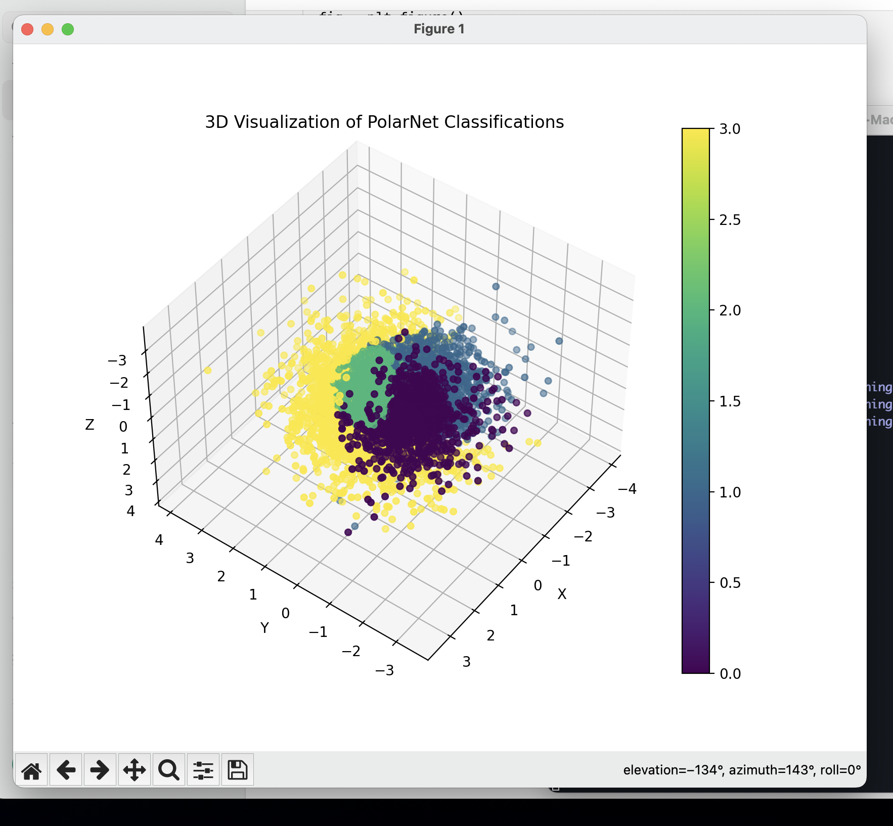

# Python & R Machine Learning

- [Python & R Machine Learning](#python--r-machine-learning)
  - [kmeans](#kmeans)
  - [least squares method](#least-squares-method)
  - [nonlinear fitting](#nonlinear-fitting)
  - [polar coordinate classification](#polar-coordinate-classification)
  - [Data cleaning](#data-cleaning)


* [R Machine Learning](https://github.com/chanshunli/jim-emacs-machine-learning/tree/master/R-Lang-machine-learning)

## kmeans
* [kmeans log analysis](./kmeans_log_analysis.py)

```python
from sklearn.feature_extraction.text import TfidfVectorizer
from sklearn.cluster import KMeans

def cluster_error_messages(error_messages, num_clusters=5):
    vectorizer = TfidfVectorizer(stop_words='english')
    X = vectorizer.fit_transform(error_messages)

    kmeans = KMeans(n_clusters=num_clusters, random_state=0)
    kmeans.fit(X)

    labels = kmeans.labels_
    clustered_errors = {}
    for i, label in enumerate(labels):
        if label not in clustered_errors:
            clustered_errors[label] = []
        clustered_errors[label].append(error_messages[i])
    return clustered_errors
```

## least squares method

```python
import numpy as np
import matplotlib.pyplot as plt

# Example data points
X = np.array([1, 2.2, 3, 4, 5])
y = np.array([2, 4, 6.3, 8, 11])

# Add a column of ones to X for the intercept term (bias)
X_b = np.c_[np.ones((X.shape[0], 1)), X]  # X_b is X with a bias column

# Calculate the best fit line parameters using the Normal Equation
theta_best = np.linalg.inv(X_b.T.dot(X_b)).dot(X_b.T).dot(y)

# Print the parameters (intercept and slope)
print(f"Intercept: {theta_best[0]}")
print(f"Slope: {theta_best[1]}")

# Predict values using the model
y_pred = X_b.dot(theta_best)

# Plot the data points and the best fit line
plt.scatter(X, y, color='blue', label='Data points')
plt.plot(X, y_pred, color='red', label='Best fit line')
plt.xlabel('X')
plt.ylabel('y')
plt.legend()
plt.show()
```

## nonlinear fitting


```python
import torch
import torch.nn as nn
import numpy as np
import matplotlib.pyplot as plt

# Step 1: Generate a 100-length random sequence
n = 100
x = torch.linspace(1, 10, n).unsqueeze(1)
y = torch.sin(x) + torch.rand(n, 1) * 0.5

# Step 2: Define a simple neural network model for nonlinear fitting
class NonlinearModel(nn.Module):
    def __init__(self):
        super(NonlinearModel, self).__init__()
        self.fc1 = nn.Linear(1, 10)
        self.fc2 = nn.Linear(10, 10)
        self.fc3 = nn.Linear(10, 1)
    
    def forward(self, x):
        x = torch.relu(self.fc1(x))
        x = torch.relu(self.fc2(x))
        x = self.fc3(x)
        return x

model = NonlinearModel()

# Step 3: Define loss function and optimizer
criterion = nn.MSELoss()
optimizer = torch.optim.Adam(model.parameters(), lr=0.01)

# Step 4: Train the model
epochs = 1000
for epoch in range(epochs):
    model.train()
    
    # Forward pass
    outputs = model(x)
    loss = criterion(outputs, y)
    
    # Backward pass and optimization
    optimizer.zero_grad()
    loss.backward()
    optimizer.step()
    
    if (epoch+1) % 100 == 0:
        print(f'Epoch [{epoch+1}/{epochs}], Loss: {loss.item():.4f}')

# Step 5: Plot the original data and the fitted curve
model.eval()
with torch.no_grad():
    predicted = model(x).numpy()

plt.figure(figsize=(10, 5))
plt.plot(x.numpy(), y.numpy(), 'ro', label='Original data')
plt.plot(x.numpy(), predicted, 'b-', label='Fitted curve')
plt.legend()
plt.show()

```
## polar coordinate classification


```python
import torch
import torch.nn as nn
import torch.optim as optim
from torch.utils.data import DataLoader, TensorDataset
import matplotlib.pyplot as plt
from mpl_toolkits.mplot3d import Axes3D

# Helper function to convert Cartesian to Polar coordinates
def cartesian_to_polar(x, y, z):
    r = torch.sqrt(x**2 + y**2 + z**2)
    theta = torch.atan2(y, x)
    phi = torch.acos(z / r)
    return r, theta, phi

# Example data generation (replace with your actual data)
n_samples = 5000
x = torch.randn(n_samples)
y = torch.randn(n_samples)
z = torch.randn(n_samples)
labels = torch.randint(0, 4, (n_samples,))  # Four classes (0, 1, 2, 3)

# Convert to polar coordinates
r, theta, phi = cartesian_to_polar(x, y, z)

# Combine into a single tensor
data = torch.stack((r, theta, phi), dim=1)

# Create a Dataset and DataLoader
dataset = TensorDataset(data, labels)
train_loader = DataLoader(dataset, batch_size=32, shuffle=True)

# Define a simple feedforward neural network
class PolarNet(nn.Module):
    def __init__(self):
        super(PolarNet, self).__init__()
        self.fc1 = nn.Linear(3, 64)
        self.fc2 = nn.Linear(64, 128)
        self.fc3 = nn.Linear(128, 4)  # Four output classes

    def forward(self, x):
        x = torch.relu(self.fc1(x))
        x = torch.relu(self.fc2(x))
        x = self.fc3(x)
        return x

# Initialize the model, loss function, and optimizer
model = PolarNet()
criterion = nn.CrossEntropyLoss()
optimizer = optim.Adam(model.parameters(), lr=0.001)

# Training loop
for epoch in range(20):  # Number of epochs
    for inputs, targets in train_loader:
        # Forward pass
        outputs = model(inputs)
        loss = criterion(outputs, targets)

        # Backward pass and optimization
        optimizer.zero_grad()
        loss.backward()
        optimizer.step()

    print(f'Epoch {epoch+1}/20, Loss: {loss.item()}')

# After training, evaluate the model on the entire dataset for visualization
with torch.no_grad():
    predicted_labels = model(data).argmax(dim=1)

# Plotting the results in 3D
fig = plt.figure()
ax = fig.add_subplot(111, projection='3d')

# Convert polar back to Cartesian for plotting
x_cartesian = r * torch.sin(phi) * torch.cos(theta)
y_cartesian = r * torch.sin(phi) * torch.sin(theta)
z_cartesian = r * torch.cos(phi)

# Plot the 3D scatter plot
scatter = ax.scatter(x_cartesian, y_cartesian, z_cartesian, c=predicted_labels, cmap='viridis', marker='o')

# Add color bar and labels
plt.colorbar(scatter, ax=ax)
ax.set_xlabel('X')
ax.set_ylabel('Y')
ax.set_zlabel('Z')
plt.title('3D Visualization of PolarNet Classifications')
plt.show()
```

## Data cleaning
* [log clean utils](./log_utils.py)
```python
## split
def split_log_file(input_file, split_pattern, output_pattern):
    with open(input_file, 'r') as file:
        log_content = file.read()
    pattern = re.compile(split_pattern)
    split_points = [match.start() for match in re.finditer(pattern, log_content)]
    split_points.append(len(log_content))
    for i in range(len(split_points) - 1):
        start = split_points[i]
        end = split_points[i + 1]
        segment = log_content[start:end]
        match = pattern.search(segment)
        if match:
            number = match.group(1)
            output_file = output_pattern.format(number=number)
            with open(output_file, 'w') as file:
                file.write(segment)
            print(f"Segment saved as {output_file}")
## patterns
def move_patterns_logs(destination_path, patterns):
    current_directory = os.getcwd()
    log_files = glob.glob("*.log")
    for log_file in log_files:
        with open(log_file, 'r') as file:
            if any(re.search(pattern, line) for pattern in patterns for line in file):
                shutil.move(os.path.join(current_directory, log_file), destination_path)
                break

## filter show or data visualization
def filter_log_file(log_file_path, exclude_keywords):
    with open(log_file_path, "r") as file:
        lines = file.readlines()
    filtered_lines = [line for line in lines if not any(keyword in line for keyword in exclude_keywords)]
    for line in filtered_lines:
        print(line, end="")

```
