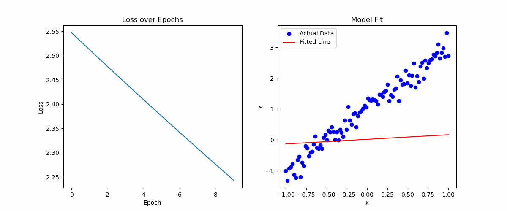
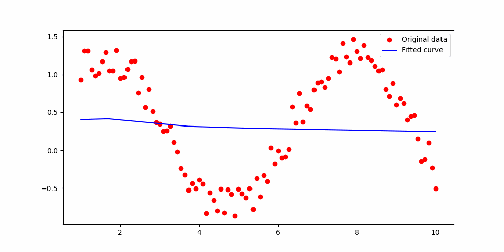
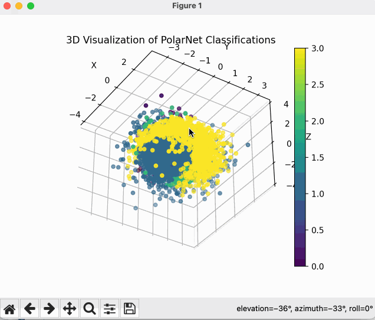
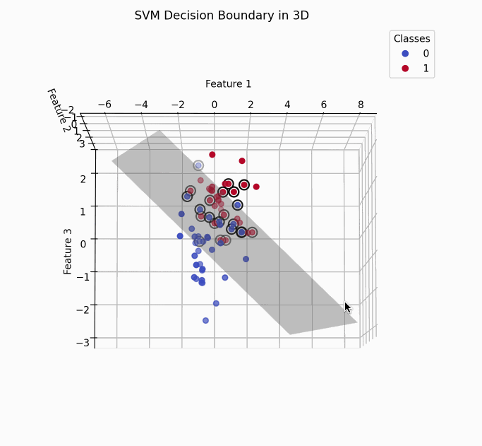
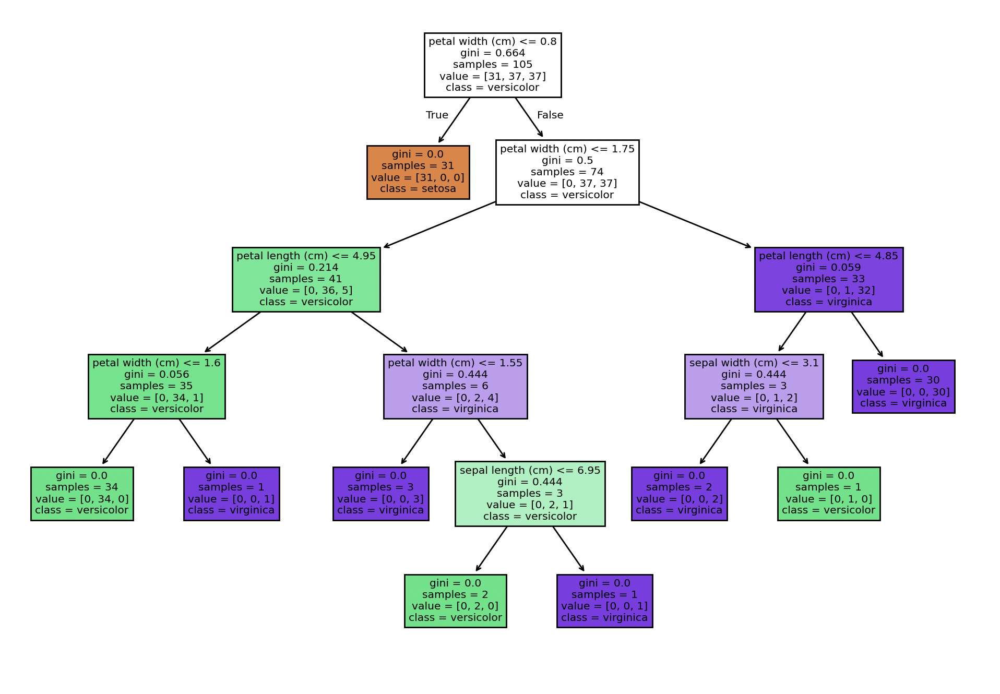
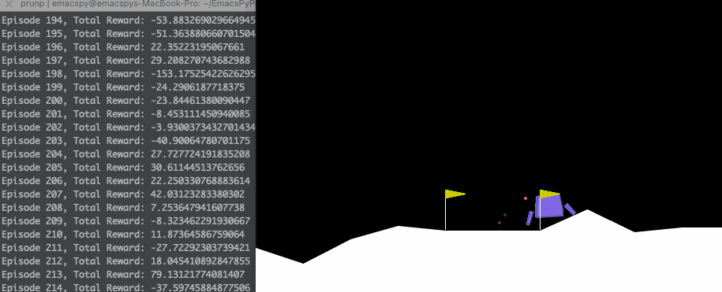
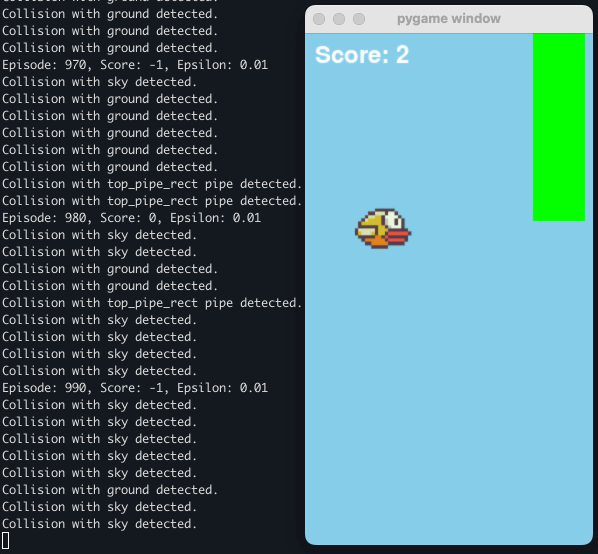
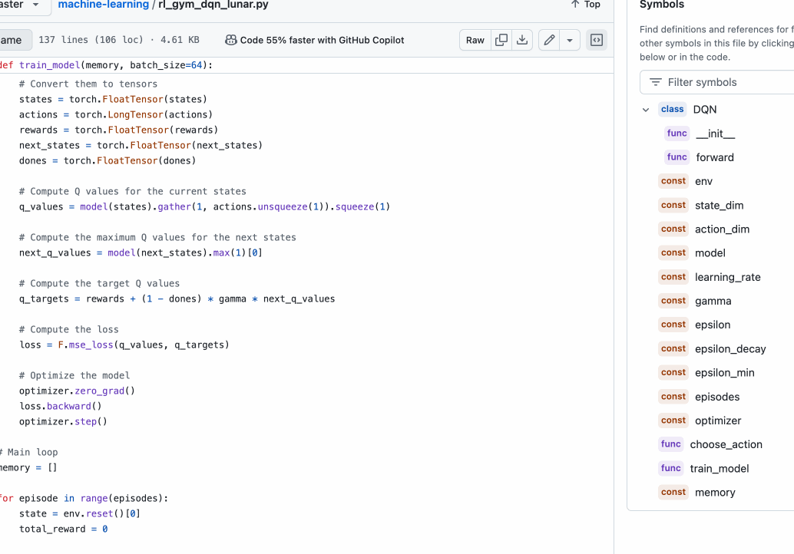

# Python & R Machine Learning

## First principle

* Find the same probability distribution in a large amount of data and make predictions based on the same probability distribution: `y = f(x)`
* Just like learning a function relationship, the inverse function or reverse engineering function requires DL. You just know that the data has a certain pattern and then guess what the original function that generated the data is. For example, you train to get a calculator neural network.
* The idea of high-dimensional space: the code is cut into high-dimensional space, and then a very detailed high-dimensional classification is done to separate it. Then the search is also high-dimensional, just like the code, it is entered into the treesitter to do training to obtain logical learning relationships. Most of NLP is a multi-classification problem in high-dimensional space.
* Collect the input x and output y around you as training data, and mine their mapping relationship f(x) at any time. You can use GPT to generate certain data for your model training needs.

- [Python & R Machine Learning](#python--r-machine-learning)
  - [R Machine Learning](https://github.com/chanshunli/jim-emacs-machine-learning/tree/master/R-Lang-machine-learning)
  - [least squares method](#least-squares-method)
  - [least squares method by neural network](#least-squares-method-by-neural-network)
  - [nonlinear fitting](#nonlinear-fitting)
  - [polar coordinate classification](#polar-coordinate-classification)
  - [mnist ocr](#mnist-ocr)
  - [use mnist](#use-mnist)
  - [calculator neural network](#calculator-neural-network)
  - [Data cleaning](#data-cleaning)
  - [SVM](#svm)
  - [kmeans](#kmeans)
  - [Decision Tree Classifier](#decision-tree-classifier)
  - [Reinforcement Learning (DQN)](#reinforcement-learning-dqn)
  - [Flappy bird dqn](#flappy-bird-dqn)
  - [SGD](#sgd)

## least squares method

```python
import numpy as np
import matplotlib.pyplot as plt

# Example data points
X = np.array([1, 2.2, 3, 4, 5])
y = np.array([2, 4, 6.3, 8, 11])

# Add a column of ones to X for the intercept term (bias)
X_b = np.c_[np.ones((X.shape[0], 1)), X]  # X_b is X with a bias column

# Calculate the best fit line parameters using the Normal Equation
theta_best = np.linalg.inv(X_b.T.dot(X_b)).dot(X_b.T).dot(y)

# Print the parameters (intercept and slope)
print(f"Intercept: {theta_best[0]}")
print(f"Slope: {theta_best[1]}")

# Predict values using the model
y_pred = X_b.dot(theta_best)

# Plot the data points and the best fit line
plt.scatter(X, y, color='blue', label='Data points')
plt.plot(X, y_pred, color='red', label='Best fit line')
plt.xlabel('X')
plt.ylabel('y')
plt.legend()
plt.show()
```

## least squares method by neural network



```python
import torch
import torch.nn as nn
import torch.optim as optim
import matplotlib.pyplot as plt

# graph show the  pytorch torch.optim.Adam and plot it How it works

# Define a simple linear model
class LinearModel(nn.Module):
    def __init__(self):
        super(LinearModel, self).__init__()
        self.linear = nn.Linear(1, 1)

    def forward(self, x):
        return self.linear(x)

# Initialize the model, loss function, and optimizer
model = LinearModel()
criterion = nn.MSELoss()
optimizer = optim.Adam(model.parameters(), lr=0.01)

# Generate some synthetic data (y = 2x + 1 with some noise)
x_train = torch.linspace(-1, 1, 100).reshape(-1, 1)
y_train = 2 * x_train + 1 + 0.2 * torch.randn(x_train.size())

# List to store the loss values
loss_values = []

# Training loop
for epoch in range(1000):
    model.train()
    optimizer.zero_grad()
    outputs = model(x_train)
    loss = criterion(outputs, y_train)
    loss.backward()
    optimizer.step()
    loss_values.append(loss.item())
```

## nonlinear fitting




```python
import torch
import torch.nn as nn
import numpy as np
import matplotlib.pyplot as plt

# Step 1: Generate a 100-length random sequence
n = 100
x = torch.linspace(1, 10, n).unsqueeze(1)
y = torch.sin(x) + torch.rand(n, 1) * 0.5

# Step 2: Define a simple neural network model for nonlinear fitting
class NonlinearModel(nn.Module):
    def __init__(self):
        super(NonlinearModel, self).__init__()
        self.fc1 = nn.Linear(1, 10)
        self.fc2 = nn.Linear(10, 10)
        self.fc3 = nn.Linear(10, 1)

    def forward(self, x):
        x = torch.relu(self.fc1(x))
        x = torch.relu(self.fc2(x))
        x = self.fc3(x)
        return x

model = NonlinearModel()

# Step 3: Define loss function and optimizer
criterion = nn.MSELoss()
optimizer = torch.optim.Adam(model.parameters(), lr=0.01)

# Step 4: Train the model
epochs = 1000
for epoch in range(epochs):
    model.train()

    # Forward pass
    outputs = model(x)
    loss = criterion(outputs, y)

    # Backward pass and optimization
    optimizer.zero_grad()
    loss.backward()
    optimizer.step()

    if (epoch+1) % 100 == 0:
        print(f'Epoch [{epoch+1}/{epochs}], Loss: {loss.item():.4f}')

# Step 5: Plot the original data and the fitted curve
model.eval()
with torch.no_grad():
    predicted = model(x).numpy()

plt.figure(figsize=(10, 5))
plt.plot(x.numpy(), y.numpy(), 'ro', label='Original data')
plt.plot(x.numpy(), predicted, 'b-', label='Fitted curve')
plt.legend()
plt.show()

```
## polar coordinate classification


```python
import torch
import torch.nn as nn
import torch.optim as optim
from torch.utils.data import DataLoader, TensorDataset
import matplotlib.pyplot as plt
from mpl_toolkits.mplot3d import Axes3D

# Helper function to convert Cartesian to Polar coordinates
def cartesian_to_polar(x, y, z):
    r = torch.sqrt(x**2 + y**2 + z**2)
    theta = torch.atan2(y, x)
    phi = torch.acos(z / r)
    return r, theta, phi

# Example data generation (replace with your actual data)
n_samples = 5000
x = torch.randn(n_samples)
y = torch.randn(n_samples)
z = torch.randn(n_samples)
labels = torch.randint(0, 4, (n_samples,))  # Four classes (0, 1, 2, 3)

# Convert to polar coordinates
r, theta, phi = cartesian_to_polar(x, y, z)

# Combine into a single tensor
data = torch.stack((r, theta, phi), dim=1)

# Create a Dataset and DataLoader
dataset = TensorDataset(data, labels)
train_loader = DataLoader(dataset, batch_size=32, shuffle=True)

# Define a simple feedforward neural network
class PolarNet(nn.Module):
    def __init__(self):
        super(PolarNet, self).__init__()
        self.fc1 = nn.Linear(3, 64)
        self.fc2 = nn.Linear(64, 128)
        self.fc3 = nn.Linear(128, 4)  # Four output classes

    def forward(self, x):
        x = torch.relu(self.fc1(x))
        x = torch.relu(self.fc2(x))
        x = self.fc3(x)
        return x

# Initialize the model, loss function, and optimizer
model = PolarNet()
criterion = nn.CrossEntropyLoss()
optimizer = optim.Adam(model.parameters(), lr=0.001)

# Training loop
for epoch in range(20):  # Number of epochs
    for inputs, targets in train_loader:
        # Forward pass
        outputs = model(inputs)
        loss = criterion(outputs, targets)

        # Backward pass and optimization
        optimizer.zero_grad()
        loss.backward()
        optimizer.step()

    print(f'Epoch {epoch+1}/20, Loss: {loss.item()}')

# After training, evaluate the model on the entire dataset for visualization
with torch.no_grad():
    predicted_labels = model(data).argmax(dim=1)

# Plotting the results in 3D
fig = plt.figure()
ax = fig.add_subplot(111, projection='3d')

# Convert polar back to Cartesian for plotting
x_cartesian = r * torch.sin(phi) * torch.cos(theta)
y_cartesian = r * torch.sin(phi) * torch.sin(theta)
z_cartesian = r * torch.cos(phi)

# Plot the 3D scatter plot
scatter = ax.scatter(x_cartesian, y_cartesian, z_cartesian, c=predicted_labels, cmap='viridis', marker='o')

# Add color bar and labels
plt.colorbar(scatter, ax=ax)
ax.set_xlabel('X')
ax.set_ylabel('Y')
ax.set_zlabel('Z')
plt.title('3D Visualization of PolarNet Classifications')
plt.show()
```

## mnist ocr

```python
import torch
import torch.nn as nn
import torch.optim as optim
import torch.nn.functional as F
from torchvision import datasets, transforms
from torch.utils.data import DataLoader

batch_size = 64
learning_rate = 0.01
epochs = 100
transform = transforms.Compose([
    transforms.ToTensor(),
    transforms.Normalize((0.1307,), (0.3081,))
])
train_dataset = datasets.MNIST(root='./data', train=True, download=True, transform=transform)
test_dataset = datasets.MNIST(root='./data', train=False, download=True, transform=transform)
train_loader = DataLoader(dataset=train_dataset, batch_size=batch_size, shuffle=True)
test_loader = DataLoader(dataset=test_dataset, batch_size=batch_size, shuffle=False)

class Net(nn.Module):
    def __init__(self):
        super(Net, self).__init__()
        self.fc1 = nn.Linear(28 * 28, 128)
        self.fc2 = nn.Linear(128, 64)
        self.fc3 = nn.Linear(64, 10)

    def forward(self, x):
        x = x.view(-1, 28 * 28)
        x = F.relu(self.fc1(x))
        x = F.relu(self.fc2(x))
        x = self.fc3(x)
        return x

model = Net()
criterion = nn.CrossEntropyLoss()
optimizer = optim.SGD(model.parameters(), lr=learning_rate)

for epoch in range(epochs):
    model.train()
    for batch_idx, (data, target) in enumerate(train_loader):
        optimizer.zero_grad()
        output = model(data)
        loss = criterion(output, target)
        loss.backward()
        optimizer.step()
        if batch_idx % 100 == 0:
            print(f'Epoch: {epoch+1}/{epochs} [Batch: {batch_idx*len(data)}/{len(train_loader.dataset)}] Loss: {loss.item():.6f}')

model.eval()
test_loss = 0
correct = 0

with torch.no_grad():
    for data, target in test_loader:
        output = model(data)
        test_loss += criterion(output, target).item()
        pred = output.argmax(dim=1, keepdim=True)
        correct += pred.eq(target.view_as(pred)).sum().item()

test_loss /= len(test_loader.dataset)
accuracy = 100. * correct / len(test_loader.dataset)
print(f'Test set: Average loss: {test_loss:.4f}, Accuracy: {correct}/{len(test_loader.dataset)} ({accuracy:.2f}%)')
torch.save(model.state_dict(), "mnist_model.pth")

```
## use mnist

```python
model = Net()
### 3. Load the Trained Model Weights
model.load_state_dict(torch.load("mnist_model.pth"))
model.eval()  # Set the model to evaluation mode

### 4. Prepare the Handwritten Input Image
#You need to preprocess the handwritten image to match the format of the MNIST dataset (28x28 pixels, grayscale).
def preprocess_image(image_path):
    transform = transforms.Compose([
        transforms.Grayscale(),  # Ensure the image is grayscale
        transforms.Resize((28, 28)),  # Resize to 28x28 pixels
        transforms.ToTensor(),  # Convert to tensor
        transforms.Normalize((0.1307,), (0.3081,))  # Normalize with the same mean and std as MNIST
    ])
    image = Image.open(image_path)
    image = transform(image).unsqueeze(0)  # Add batch dimension
    return image

### 5. Perform Inference
def recognize_digit(image_path):
    image = preprocess_image(image_path)
    with torch.no_grad():
        output = model(image)
        prediction = output.argmax(dim=1, keepdim=True)
    return prediction.item()

# Example usage
image_path = 'path_to_your_handwritten_digit_image3.png'
predicted_digit = recognize_digit(image_path)
print(f'Predicted Digit: {predicted_digit}')

```

## calculator neural network

```python
import torch
import torch.nn as nn
import torch.optim as optim
import random
import numpy as np

# Define the neural network architecture
class CalculatorNN(nn.Module):
    def __init__(self):
        super(CalculatorNN, self).__init__()
        self.fc1 = nn.Linear(3, 128)  # Input: 2 numbers + operation
        self.fc2 = nn.Linear(128, 64)
        self.fc3 = nn.Linear(64, 1)   # Output: the result

    def forward(self, x):
        x = torch.relu(self.fc1(x))
        x = torch.relu(self.fc2(x))
        x = self.fc3(x)
        return x

model = CalculatorNN()
criterion = nn.MSELoss()
optimizer = optim.Adam(model.parameters(), lr=0.001)

# Training loop
num_epochs = 50000 # loss is too large if is 5000.
for epoch in range(num_epochs):
    model.train()
    # Forward pass
    predictions = model(X_train)
    loss = criterion(predictions, y_train)
    # Backward pass and optimization
    optimizer.zero_grad()
    loss.backward()
    optimizer.step()
    if (epoch + 1) % 10 == 0:
        print(f'Epoch [{epoch+1}/{num_epochs}], Loss: {loss.item():.4f}')

# ---- use
model = CalculatorNN()
model.load_state_dict(torch.load('calculator_model.pth'))
model.eval()


# Perform the prediction
with torch.no_grad():
    # Prepare the input (32 * 3)
    input_data = torch.tensor([[32.0, 3.0, 2]], dtype=torch.float32)  # 2 corresponds to multiplication
    prediction = model(input_data)
    print(f'Prediction for 32 * 3: {prediction.item():.4f}')

```

## Data cleaning
* [log clean utils](./log_utils.py)
```python
## split
def split_log_file(input_file, split_pattern, output_pattern):
    with open(input_file, 'r') as file:
        log_content = file.read()
    pattern = re.compile(split_pattern)
    split_points = [match.start() for match in re.finditer(pattern, log_content)]
    split_points.append(len(log_content))
    for i in range(len(split_points) - 1):
        start = split_points[i]
        end = split_points[i + 1]
        segment = log_content[start:end]
        match = pattern.search(segment)
        if match:
            number = match.group(1)
            output_file = output_pattern.format(number=number)
            with open(output_file, 'w') as file:
                file.write(segment)
            print(f"Segment saved as {output_file}")
## patterns
def move_patterns_logs(destination_path, patterns):
    current_directory = os.getcwd()
    log_files = glob.glob("*.log")
    for log_file in log_files:
        with open(log_file, 'r') as file:
            if any(re.search(pattern, line) for pattern in patterns for line in file):
                shutil.move(os.path.join(current_directory, log_file), destination_path)
                break

## filter show or data visualization
def filter_log_file(log_file_path, exclude_keywords):
    with open(log_file_path, "r") as file:
        lines = file.readlines()
    filtered_lines = [line for line in lines if not any(keyword in line for keyword in exclude_keywords)]
    for line in filtered_lines:
        print(line, end="")

```

## SVM

```python
import numpy as np
import matplotlib.pyplot as plt
from mpl_toolkits.mplot3d import Axes3D
from sklearn.datasets import make_classification
from sklearn.svm import SVC
from sklearn.preprocessing import StandardScaler
from sklearn.model_selection import train_test_split
X, y = make_classification(n_samples=100, n_features=3, n_informative=3, n_redundant=0, n_classes=2, random_state=42)
X_train, X_test, y_train, y_test = train_test_split(X, y, test_size=0.3, random_state=42)
scaler = StandardScaler()
X_train = scaler.fit_transform(X_train)
X_test = scaler.transform(X_test)
model = SVC(kernel='linear')
model.fit(X_train, y_train)
def plot_svm_decision_boundary_3d(model, X, y):
    fig = plt.figure(figsize=(10, 8))
    ax = fig.add_subplot(111, projection='3d')
    # Plot the training points
    scatter = ax.scatter(X[:, 0], X[:, 1], X[:, 2], c=y, s=30, cmap=plt.cm.coolwarm)
    # Create grid to evaluate model (this defines the 3D space)
    xlim = ax.get_xlim()
    ylim = ax.get_ylim()
    zlim = ax.get_zlim()
    xx = np.linspace(xlim[0], xlim[1], 20)
    yy = np.linspace(ylim[0], ylim[1], 20)
    zz = np.linspace(zlim[0], zlim[1], 20)
    # Create a meshgrid to evaluate the decision function
    YY, ZZ = np.meshgrid(yy, zz)
    XX = -(model.coef_[0][0] * YY + model.coef_[0][2] * ZZ + model.intercept_) / model.coef_[0][1]
    # Plot the decision surface
    ax.plot_surface(XX, YY, ZZ, color='gray', alpha=0.3, rstride=100, cstride=100)
    # Highlight support vectors
    ax.scatter(model.support_vectors_[:, 0], model.support_vectors_[:, 1], model.support_vectors_[:, 2],
               s=100, facecolors='none', edgecolors='k', linewidth=1.5, label='Support Vectors')
    ax.set_title('SVM Decision Boundary in 3D')
    ax.set_xlabel('Feature 1')
    ax.set_ylabel('Feature 2')
    ax.set_zlabel('Feature 3')
    # Add color legend
    legend1 = ax.legend(*scatter.legend_elements(), loc="best", title="Classes")
    ax.add_artist(legend1)
    plt.show()
plot_svm_decision_boundary_3d(model, X_train, y_train)
```

## kmeans
* [kmeans log analysis](./kmeans_log_analysis.py)

```python
from sklearn.feature_extraction.text import TfidfVectorizer
from sklearn.cluster import KMeans

def cluster_error_messages(error_messages, num_clusters=5):
    vectorizer = TfidfVectorizer(stop_words='english')
    X = vectorizer.fit_transform(error_messages)

    kmeans = KMeans(n_clusters=num_clusters, random_state=0)
    kmeans.fit(X)

    labels = kmeans.labels_
    clustered_errors = {}
    for i, label in enumerate(labels):
        if label not in clustered_errors:
            clustered_errors[label] = []
        clustered_errors[label].append(error_messages[i])
    return clustered_errors
```
## Decision Tree Classifier



```python

import matplotlib.pyplot as plt
from sklearn.datasets import load_iris
from sklearn.model_selection import train_test_split
from sklearn.tree import DecisionTreeClassifier, plot_tree
from sklearn import metrics
iris = load_iris()
X = iris.data  # Features
y = iris.target  # Labels
X_train, X_test, y_train, y_test = train_test_split(X, y, test_size=0.3, random_state=42)
clf = DecisionTreeClassifier()
clf.fit(X_train, y_train)
y_pred = clf.predict(X_test)
accuracy = metrics.accuracy_score(y_test, y_pred)
print(f"Accuracy: {accuracy * 100:.2f}%")
plt.figure(figsize=(12,8))
plot_tree(clf, feature_names=iris.feature_names, class_names=iris.target_names, filled=True)
plt.show()

```

## Reinforcement Learning (DQN)




```python
import torch
import torch.nn as nn
import torch.optim as optim
import torch.nn.functional as F
import numpy as np
import random

# Define a simple fully connected neural network
class DQN(nn.Module):
    def __init__(self, input_dim, output_dim):
        super(DQN, self).__init__()
        self.fc1 = nn.Linear(input_dim, 128)
        self.fc2 = nn.Linear(128, 128)
        self.fc3 = nn.Linear(128, output_dim)

    def forward(self, x):
        x = F.relu(self.fc1(x))
        x = F.relu(self.fc2(x))
        return self.fc3(x)

# ### 3. **Initialize the environment and model:**

import gymnasium as gym
import torch

env = gym.make("LunarLander-v2", render_mode="human")
state_dim = env.observation_space.shape[0]
action_dim = env.action_space.n

# Create the DQN model
model = DQN(input_dim=state_dim, output_dim=action_dim)

# ### 4. **Define the training loop:**
# In this section, we'll define how the agent interacts with the environment, how rewards are collected, and how the model is updated.

# Parameters
learning_rate = 0.001
gamma = 0.99  # Discount factor
epsilon = 1.0  # Exploration rate
epsilon_decay = 0.995
epsilon_min = 0.01
episodes = 500

# Optimizer
optimizer = optim.Adam(model.parameters(), lr=learning_rate)

# Function to choose action (using epsilon-greedy policy)
def choose_action(state, epsilon):
    if np.random.rand() <= epsilon:
        return np.random.choice(action_dim)  # Random action
    state = torch.FloatTensor(state).unsqueeze(0)
    with torch.no_grad():
        q_values = model(state)
    return torch.argmax(q_values).item()

# Function to train the model
def train_model(memory, batch_size=64):
    if len(memory) < batch_size:
        return

    # Randomly sample a batch from memory
    batch = random.sample(memory, batch_size)

    # Extract states, actions, rewards, next_states, and dones from the batch
    states, actions, rewards, next_states, dones = zip(*batch)

    # Convert them to tensors
    states = torch.FloatTensor(states)
    actions = torch.LongTensor(actions)
    rewards = torch.FloatTensor(rewards)
    next_states = torch.FloatTensor(next_states)
    dones = torch.FloatTensor(dones)

    # Compute Q values for the current states
    q_values = model(states).gather(1, actions.unsqueeze(1)).squeeze(1)

    # Compute the maximum Q values for the next states
    next_q_values = model(next_states).max(1)[0]

    # Compute the target Q values
    q_targets = rewards + (1 - dones) * gamma * next_q_values

    # Compute the loss
    loss = F.mse_loss(q_values, q_targets)

    # Optimize the model
    optimizer.zero_grad()
    loss.backward()
    optimizer.step()

# Main loop
memory = []

for episode in range(episodes):
    state = env.reset()[0]
    total_reward = 0

    for t in range(1000):
        action = choose_action(state, epsilon)
        next_state, reward, done, truncated, _ = env.step(action)
        memory.append((state, action, reward, next_state, done))

        train_model(memory)

        state = next_state
        total_reward += reward
        if done or truncated:
            break

    epsilon = max(epsilon_min, epsilon * epsilon_decay)
    print(f"Episode {episode + 1}, Total Reward: {total_reward}")

env.close()
```

## Flappy bird dqn



```python
import gymnasium as gym
import numpy as np
import pygame
from gymnasium import spaces
import torch
import torch.nn as nn
import torch.optim as optim
import random
from collections import deque
import time

import pygame
import numpy as np
from gymnasium import spaces

from flappy_bird_cl3_pass_env_to_nn_3 import FlappyBirdEnv

class DQN(nn.Module):
    def __init__(self, input_size, n_actions):
        super(DQN, self).__init__()
        self.fc = nn.Sequential(
            nn.Linear(input_size, 64),
            nn.ReLU(),
            nn.Linear(64, 64),
            nn.ReLU(),
            nn.Linear(64, n_actions)
        )

    def forward(self, x):
        return self.fc(x)

class DQNAgent:
    def __init__(self, env, learning_rate=1e-3, gamma=0.99, epsilon_start=1.0, epsilon_final=0.01, epsilon_decay=0.995):
        self.env = env
        self.n_actions = env.action_space.n
        self.device = torch.device("cuda" if torch.cuda.is_available() else "cpu")

        self.epsilon = epsilon_start
        self.epsilon_final = epsilon_final
        self.epsilon_decay = epsilon_decay

        self.memory = deque(maxlen=10000)
        self.batch_size = 64

        state_size = len(env.get_state())
        self.model = DQN(state_size, self.n_actions).to(self.device)
        self.optimizer = optim.Adam(self.model.parameters(), lr=learning_rate)
        self.criterion = nn.MSELoss()

        self.gamma = gamma

    def get_action(self, state):
        if random.random() < self.epsilon:
            return random.randint(0, self.n_actions - 1)

        with torch.no_grad():
            state = torch.FloatTensor(state).unsqueeze(0).to(self.device)
            q_values = self.model(state)
            return torch.argmax(q_values).item()

    def update_epsilon(self):
        self.epsilon = max(self.epsilon_final, self.epsilon * self.epsilon_decay)

    def remember(self, state, action, reward, next_state, done):
        self.memory.append((state, action, reward, next_state, done))

    def train(self):
        if len(self.memory) < self.batch_size:
            return

        batch = random.sample(self.memory, self.batch_size)
        states, actions, rewards, next_states, dones = zip(*batch)

        states = torch.FloatTensor(states).to(self.device)
        actions = torch.LongTensor(actions).to(self.device)
        rewards = torch.FloatTensor(rewards).to(self.device)
        next_states = torch.FloatTensor(next_states).to(self.device)
        dones = torch.FloatTensor(dones).to(self.device)

        current_q_values = self.model(states).gather(1, actions.unsqueeze(1))
        with torch.no_grad():
            next_q_values = self.model(next_states).max(1)[0]
        target_q_values = rewards + (1 - dones) * self.gamma * next_q_values

        loss = self.criterion(current_q_values.squeeze(), target_q_values)

        self.optimizer.zero_grad()
        loss.backward()
        self.optimizer.step()

def train_dqn(env, episodes=2000, max_steps=1000, render_interval=10):
    agent = DQNAgent(env)
    scores = []

    for episode in range(episodes):
        state = env.reset()
        score = 0

        for step in range(max_steps):
            if episode % render_interval == 0:
                env.render()

            action = agent.get_action(state)
            next_state, reward, done, _, _ = env.step(action)
            agent.remember(state, action, reward, next_state, done)
            agent.train()

            state = next_state
            score += reward

            if done:
                break

            if episode % render_interval == 0:
                pygame.event.pump()

        agent.update_epsilon()
        scores.append(score)

        if episode % 10 == 0:
            print(f"Episode: {episode}, Score: {score}, Epsilon: {agent.epsilon:.2f}")

    return agent, scores

if __name__ == "__main__":
    env = FlappyBirdEnv()
    agent, scores = train_dqn(env, episodes=6000, render_interval=50)

    # Test the trained agent
    state = env.reset()
    done = False
    score = 0

    while not done:
        env.render()
        action = agent.get_action(state)
        next_state, reward, done, _, _ = env.step(action)
        state = next_state
        score += reward

        for event in pygame.event.get():
            if event.type == pygame.QUIT:
                done = True

        pygame.event.pump()
        time.sleep(0.03)

    print(f"Final Score: {score}")
    env.close()
```

## SGD


```python
import torch
import numpy as np
import matplotlib.pyplot as plt
from mpl_toolkits.mplot3d import Axes3D
from matplotlib.animation import FuncAnimation

# Random 3D surface (loss function)
def loss_function(x, y):
    return torch.sin(x) * torch.cos(y) + 0.1 * (x**2 + y**2)

# Generate a meshgrid for plotting the surface
x = torch.linspace(-5, 5, 100)
y = torch.linspace(-5, 5, 100)
X, Y = torch.meshgrid(x, y)
Z = loss_function(X, Y).detach().numpy()

# Initialize figure and 3D axis for animation
fig = plt.figure(figsize=(10, 7))
ax = fig.add_subplot(111, projection='3d')
ax.set_xlabel('X')
ax.set_ylabel('Y')
ax.set_zlabel('Z')
ax.set_title('SGD Optimization Path on 3D Surface')

# Plot the static 3D surface
ax.plot_surface(X.numpy(), Y.numpy(), Z, cmap='viridis', alpha=0.7)

# SGD starting point
start_point = torch.tensor([4.0, 4.0], requires_grad=True)

# Hyperparameters
learning_rate = 0.1
optimizer = torch.optim.SGD([start_point], lr=learning_rate)

# Number of steps and animation frames
steps = 10
path = np.zeros((steps, 3))

# Plotting the initial point on the surface
point_plot, = ax.plot([], [], [], color='r', marker='o', markersize=5)

# Function to update the frame during animation
def update(i):
    global start_point

    optimizer.zero_grad()

    # Calculate the loss (z value)
    loss = loss_function(start_point[0], start_point[1])

    # Backpropagation to compute gradients
    loss.backward()

    # Perform optimization step
    optimizer.step()

    # Store the (x, y, z) values
    path[i, 0] = start_point[0].item()
    path[i, 1] = start_point[1].item()
    path[i, 2] = loss.item()

    # Update point on the surface
    point_plot.set_data(path[:i+1, 0], path[:i+1, 1])
    point_plot.set_3d_properties(path[:i+1, 2])
    
    return point_plot,

# Animate SGD for 10 steps
ani = FuncAnimation(fig, update, frames=steps, interval=500, blit=True)

# Show the animation
plt.show()

```
