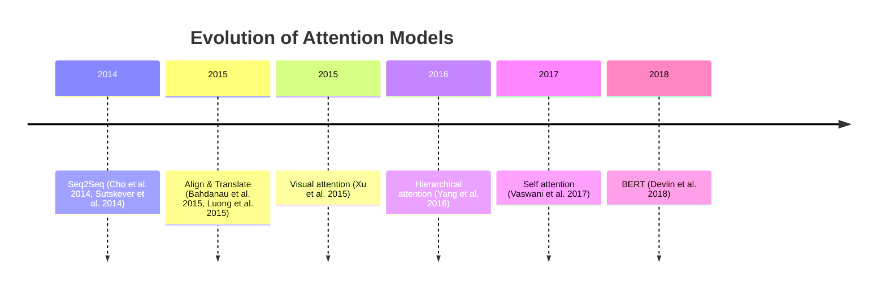
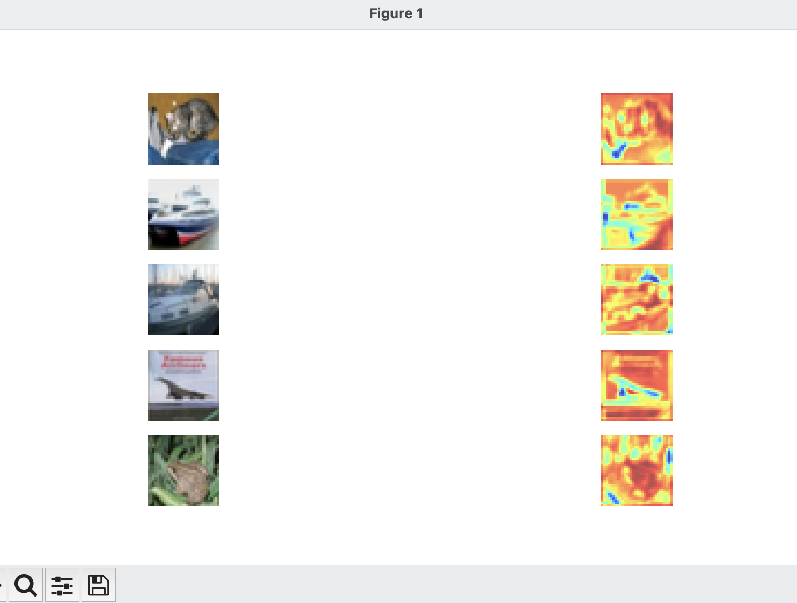
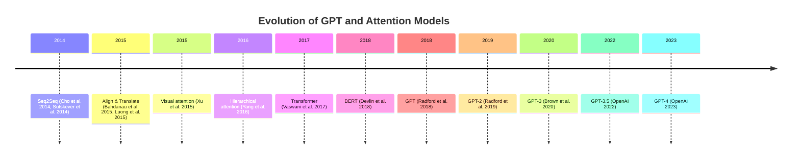

## Attention 

```mermaid
timeline
    title Evolution of Attention Models

    2014 : Seq2Seq (Cho et al. 2014, Sutskever et al. 2014)
    2015 : Align & Translate (Bahdanau et al. 2015, Luong et al. 2015)
    2015 : Visual attention (Xu et al. 2015)
    2016 : Hierarchical attention (Yang et al. 2016)
    2017 : Self attention (Vaswani et al. 2017)
    2018 : BERT (Devlin et al. 2018)
```

# GPT

```mermaid

timeline
    title Evolution of GPT and Attention Models

    2014 : Seq2Seq (Cho et al. 2014, Sutskever et al. 2014)
    2015 : Align & Translate (Bahdanau et al. 2015, Luong et al. 2015)
    2015 : Visual attention (Xu et al. 2015)
    2016 : Hierarchical attention (Yang et al. 2016)
    2017 : Transformer (Vaswani et al. 2017)
    2018 : BERT (Devlin et al. 2018)
    2018 : GPT (Radford et al. 2018)
    2019 : GPT-2 (Radford et al. 2019)
    2020 : GPT-3 (Brown et al. 2020)
    2022 : GPT-3.5 (OpenAI 2022)
    2023 : GPT-4 (OpenAI 2023)
```
