# 大学4年没讲明白的概率论，被一段 PyTorch 代码讲透了

> 概率论学了一学期，考完就还给老师了：贝叶斯公式背得滚瓜烂熟，却说不清它到底有什么用；
> 高斯、泊松、伯努利一堆分布，只记得密度函数长什么样，不知道为什么会有这些分布、什么时候该用哪个。
>
> 这篇文章换个讲法：**不写一个数学公式**，全部用能跑的 PyTorch 代码，
> 把概率论里最该懂的几件事讲透——
>
> - 一个"分布"到底是什么？为什么说**采样**比公式更本质？
> - 神经网络做预测，到底在预测什么？是不是所有 AI 都建立在"同分布"这个假设上？
> - 为什么从高斯到泊松到伯努利，深度学习里高斯出现得最多？
> - 这些分布在生活里到底对应什么：泊松预测流量、伯努利预测点击、指数预测等待……
>
> 读完你会发现：**概率不是一堆公式，而是一台"会掷骰子的机器"**，
> 而训练神经网络，本质就是在调这台机器，让它掷出来的结果像真实世界。

---

## 0. 一句话主线

整个"用概率做预测"，就是下面这三步：

```python
dist = make_distribution(params)   # ① 一个分布 = 一台会掷骰子的机器
samples = dist.sample()            # ② 采样：让机器掷一把，得到真实世界那样的数据
loss = -dist.log_prob(real_data)   # ③ 似然：真实数据在这台机器眼里有多"正常"
```

- **第 ①步**：分布不是公式，是一台带旋钮（参数）的掷骰子机器。
- **第 ②步**：采样才是分布的"本体"——你能掷出数据，就等于你拥有了这个分布。
- **第 ③步**：训练 = 拧旋钮，让真实数据在机器眼里尽可能"正常"（似然最大）。

神经网络干的事，就是把第 ①步里的 `params` 换成"网络根据输入算出来的东西"。
下面逐块拆开。**每一节的代码都配了一张图**——光看数字没感觉，画出来才一眼看懂。

> **运行前先跑一次这段（中文显示 + 画图准备），后面每段代码都默认它已经执行过：**
>
> ```python
> import matplotlib.pyplot as plt
> # macOS 用 'Arial Unicode MS'；Windows 可换 'SimHei'；Linux 可换 'WenQuanYi Zen Hei'
> plt.rcParams["font.sans-serif"] = ["Arial Unicode MS"]
> plt.rcParams["axes.unicode_minus"] = False
> ```

---

## 1. 分布是什么：一台会掷骰子的机器

课本告诉你"高斯分布的密度函数是 e 的负二分之 x 平方……"，然后你就睡着了。
忘掉公式。**一个分布，就是一台你按一下按钮、它就吐一个数的机器。**
不同的分布，就是不同脾气的机器：

```python
import torch

# 三台不同脾气的"掷骰子机器"，各掷 5 把
normal  = torch.distributions.Normal(loc=0.0, scale=1.0)        # 高斯：爱吐 0 附近的数
poisson = torch.distributions.Poisson(rate=3.0)                 # 泊松：吐"次数"，平均 3 次
bern    = torch.distributions.Bernoulli(probs=0.7)              # 伯努利：只吐 0 或 1，七成是 1

# 每台机器掷 10 万把，画出"它爱吐哪些数"
import matplotlib.pyplot as plt
fig, ax = plt.subplots(1, 3, figsize=(12, 3.4))
ax[0].hist(normal.sample((100000,)).numpy(), bins=50)
ax[0].set_title("高斯：爱吐 0 附近的数")
ax[1].hist(poisson.sample((100000,)).numpy(), bins=range(0, 13), align="left", rwidth=0.85)
ax[1].set_title("泊松：吐次数，平均 3 次")
ax[2].hist(bern.sample((100000,)).numpy(), bins=[-0.25, 0.25, 0.75, 1.25], rwidth=0.6)
ax[2].set_title("伯努利：只吐 0/1，七成是 1")
plt.tight_layout(); plt.show()
```

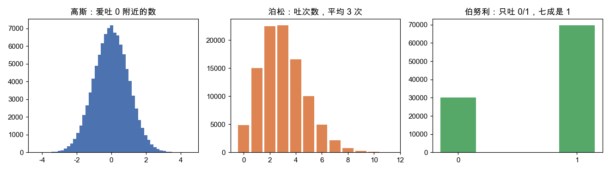

一眼看出三台机器的"脾气"完全不同：高斯是对称的钟形，泊松是偏向左边的整数堆，伯努利只有两根柱子。
记住这个画面：**分布 = 一台机器；参数 = 机器上的旋钮；采样 = 按一下按钮。**
你说不出高斯的公式没关系，但只要你能让它"掷出像样的数"，你就真正拥有了它。

### 1.1 "密度"只是机器的脾气说明书

那密度函数（PDF）是干嘛的？它不预测任何单次结果，它只描述这台机器的**脾气**——
"它更爱吐哪些数"。验证一下：掷一百万把，统计每个值出现的频率，
画出来就正好是那条钟形曲线。

```python
import torch

import matplotlib.pyplot as plt, math

normal = torch.distributions.Normal(0.0, 1.0)
samples = normal.sample((1_000_000,)).numpy()     # 掷 100 万把

plt.figure(figsize=(7, 4))
plt.hist(samples, bins=80, density=True, alpha=0.85, label="掷100万把的频率")  # 实际掷骰子
xs = torch.linspace(-4, 4, 200)
plt.plot(xs.numpy(), (torch.exp(-xs**2/2)/math.sqrt(2*math.pi)).numpy(),
         "r-", lw=2.5, label="密度曲线(脾气说明书)")                          # 公式画的曲线
plt.title("密度 = 采样频率的形状"); plt.legend(); plt.show()
# 红色曲线(说明书) 严丝合缝盖在灰色柱子(实际掷出来的频率)上
```

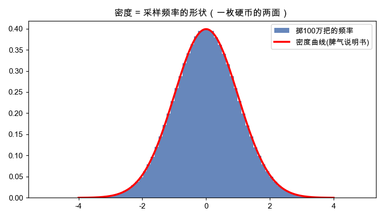

**所以密度（脾气说明书）和采样（实际掷骰子）是一枚硬币的两面。**
课本只教了说明书，却没让你按过一次按钮——这就是为什么学完没感觉。

---

## 2. 神经网络在预测什么：它输出的是一台"定制机器"

这是全篇最关键的认知翻转。很多人以为神经网络"输入 x，输出一个答案 y"。
**错。前馈网络真正输出的，是一台为这个 x 量身定制的掷骰子机器的旋钮。**

回想最普通的回归：网络吃进 `x`，吐出一个数 `pred`。
这个 `pred` 不是"答案"，而是"一台高斯机器的中心位置"：

```python
import torch
import torch.nn as nn

import matplotlib.pyplot as plt, math

net = nn.Sequential(nn.Linear(1, 16), nn.ReLU(), nn.Linear(16, 1))

x = torch.tensor([[2.0]])
mu = net(x).item()                           # 网络输出 = 高斯机器的旋钮(中心)
dist = torch.distributions.Normal(mu, 1.0)   # 它其实定义了一整台机器
samp = dist.sample((400,))

xs = torch.linspace(mu-4, mu+4, 200)
plt.figure(figsize=(7, 4))
plt.plot(xs.numpy(), (torch.exp(-(xs-mu)**2/2)/math.sqrt(2*math.pi)).numpy(),
         "r-", lw=2.5, label="网络定义的高斯机器")
plt.axvline(mu, color="k", ls="--", label=f"网络输出的中心 mu={mu:.2f}")
plt.scatter(samp.numpy(), torch.rand(400).numpy()*0.05, s=8, alpha=0.3, label="从这台机器掷出的样本")
plt.title("预测值不是一个死数，而是一团可能性"); plt.legend(); plt.show()
```

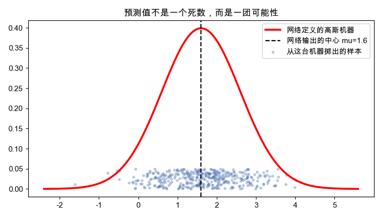

为什么要这么理解？因为真实世界的 `y` 永远带噪声，不是定值。
同样的房子面积，成交价每次都不同；同样的天气，明天气温有个范围。
**网络学的从来不是"那个唯一答案"，而是"答案的分布中心"。**

> 这就接上了上一篇《从线性到非线性》第 4 节的结论：
> `MSELoss` 之所以合理，正因为它等价于"假设这台机器是高斯的，让真实数据最可能被掷出来"。
> 换句话说：**用 MSE 训练，就是在拧高斯机器的中心旋钮。**

### 2.1 分类任务：网络输出的是一台"多面骰子"

回归输出高斯机器，那分类呢？输出的是一台**多面骰子**（Categorical 分布）的旋钮——
也就是 softmax 之后那组"加起来等于 1"的概率：

```python
import torch

import matplotlib.pyplot as plt

scores = torch.tensor([2.0, 1.0, 0.1])        # 网络对 3 个类别打的原始分
probs  = torch.softmax(scores, dim=0)          # 变成一台 3 面骰子的旋钮

plt.figure(figsize=(6, 4))
plt.bar(["类别0", "类别1", "类别2"], probs.numpy())
for i, v in enumerate(probs):
    plt.text(i, v + 0.01, f"{v:.2f}", ha="center")
plt.title(f"分类网络输出 = 多面骰子的旋钮（和={probs.sum():.0f}）"); plt.ylim(0, 0.8); plt.show()
```

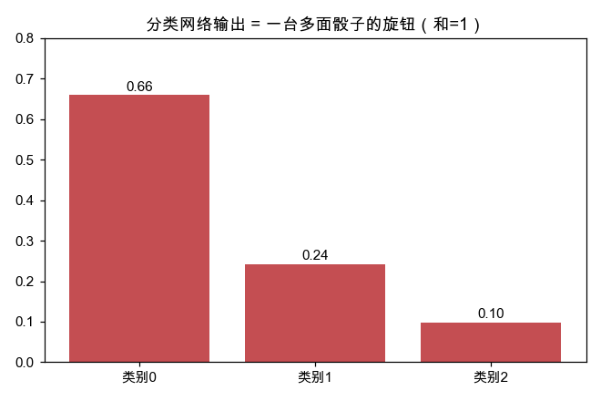

**无论回归还是分类，神经网络的输出层永远在做同一件事：吐出某台掷骰子机器的旋钮。**
回归吐的是高斯的中心，分类吐的是骰子各面的概率。这就是"概率视角"统一一切的地方。

---

## 3. 疑惑点一：所有神经网络 AI，都建立在"同分布"假设上吗？

这是最值得展开的一问。答案是：**绝大多数监督学习确实死死依赖一个假设——
训练数据和将来要预测的数据，来自同一台掷骰子机器（独立同分布，i.i.d.）。**

周志华的《机器学习》（西瓜书）开篇就把这件事说死了：我们假设样本是从某个**未知分布 D**
里**独立同分布**地抽出来的，学习的目标是用抽到的这把样本，去逼近**整个 D**。
换句话说，机器学习从第一行公式起，就站在概率的地基上——这块地基的来龙去脉，
我们留到第 9 节用代码彻底刨开。这里先把"地基一旦塌了会怎样"演给你看。

### 3.1 同分布成立时：模型表现如训练时一样好

```python
import torch
import torch.nn as nn

torch.manual_seed(0)
# 训练数据：x 来自 [-3, 3] 这台"出题机器"
x_train = (torch.rand(500, 1) - 0.5) * 6
y_train = torch.sin(x_train) + torch.randn(500, 1) * 0.1

net = nn.Sequential(nn.Linear(1, 32), nn.ReLU(),
                    nn.Linear(32, 32), nn.ReLU(), nn.Linear(32, 1))
opt = torch.optim.Adam(net.parameters(), lr=0.01)
for _ in range(2000):
    loss = ((net(x_train) - y_train) ** 2).mean()
    opt.zero_grad(); loss.backward(); opt.step()

# 测试数据：来自【同一台】出题机器 [-3, 3]
x_same = (torch.rand(200, 1) - 0.5) * 6
err_same = ((net(x_same) - torch.sin(x_same)) ** 2).mean()
print("同分布测试误差:", err_same.item())   # 很小，模型表现很好
```

### 3.2 分布一变（OOD），模型立刻崩

```python
import torch
import matplotlib.pyplot as plt

# 把整条 [-3, 12] 画出来：训练只覆盖了 [-3, 3]，右边是从没见过的区域
xx = torch.linspace(-3, 12, 400).unsqueeze(1)
with torch.no_grad():
    pred = net(xx)

plt.figure(figsize=(9, 4.2))
plt.axvspan(-3, 3, color="#cde7c8", alpha=0.6, label="训练分布覆盖区 [-3,3]")
plt.axvspan(3, 12, color="#f5c9c6", alpha=0.5, label="没见过的区域 (OOD)")
plt.plot(xx.numpy(), torch.sin(xx).numpy(), "k--", lw=1.5, label="真实规律 sin(x)")
plt.plot(xx.numpy(), pred.numpy(), "b-", lw=2, label="网络预测")
plt.scatter(x_train.numpy(), y_train.numpy(), s=6, alpha=0.25, color="green")
plt.title("同分布内贴合，越过边界立刻崩"); plt.legend(loc="lower left", fontsize=8); plt.show()
# 绿区里蓝线死死咬住虚线；一进红区，蓝线立刻脱缰乱画 —— 那里没有数据约束它
```

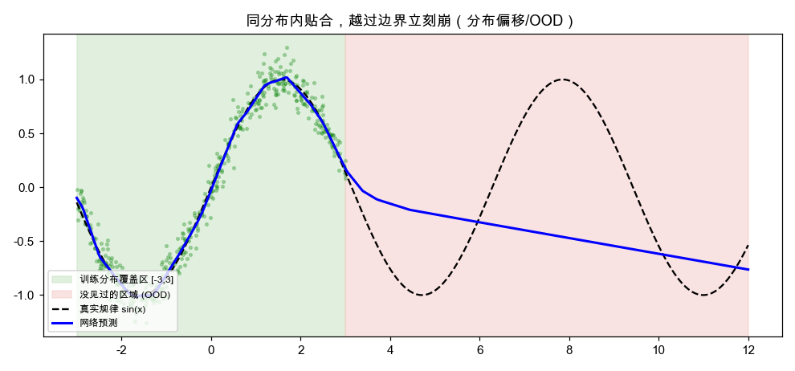

绿区（训练见过）里预测和真值严丝合缝，一进红区（没见过）预测立刻"脱缰"。
**结论一句话：神经网络只在"训练分布覆盖到的地方"靠谱。**
这就是工业界天天头疼的 **分布偏移（distribution shift）/ OOD** 问题：
自动驾驶在没见过的天气下出事、风控模型遇到新型欺诈失灵、
推荐系统在用户口味突变后推得稀烂——**根子都是"同分布假设"被打破了。**

### 3.3 那"不假设同分布"的 AI 存在吗？

存在，但它们是在**想办法绕开或放宽**这个假设，而不是不要它：

| 技术 | 它怎么对付"分布会变" |
|---|---|
| 迁移学习 / 微调 | 承认新任务分布不同，用少量新数据把旋钮重新拧一拧 |
| 域自适应 | 主动把两个分布"对齐"，强行让它们看起来同分布 |
| 在线学习 | 分布一直在变，那就一直学，永不停手 |
| 强化学习 | 数据分布由智能体自己的行为产生，是个"会移动的靶子" |

所以更准确的说法是：**同分布是默认地基；先进方法都是在地基会晃动时打补丁。**
没有任何方法能在"完全没见过、毫无规律可循"的数据上凭空预测——那不叫学习，叫算命。

---

## 4. 疑惑点二：为什么高斯用得最多，而不是别的分布？

深度学习里到处是高斯：MSE 损失、参数初始化、VAE、扩散模型加的噪声……
为什么偏偏是它？不是因为它简单，而是有几条硬核理由。用代码逐条看。

### 4.1 理由一：中心极限定理——大量小因素叠加，自动变成高斯

这是最深刻的原因。**只要一个量是"很多个互相独立的小随机因素加起来"的结果，
不管这些小因素自己是什么分布，加起来就会越来越像高斯。** 亲手验证：

```python
import torch

import matplotlib.pyplot as plt

# 用【均匀分布】(长得像方块，一点不像钟形)做小因素，看叠加后变什么
fig, ax = plt.subplots(1, 2, figsize=(11, 3.8))
ax[0].hist(torch.rand(100_000).numpy(), bins=40)
ax[0].set_title("单个小因素：均匀分布（方块，毫不像钟形）")

summed = torch.rand(100_000, 30).sum(dim=1)      # 每行 30 个均匀小因素加起来
ax[1].hist(summed.numpy(), bins=60)
ax[1].set_title("30 个均匀因素一加 → 奇迹般变成钟形")
plt.tight_layout(); plt.show()
```

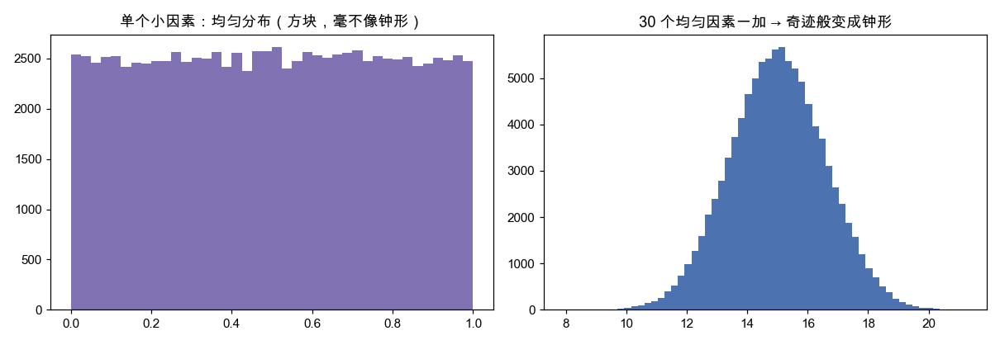

左边的方块（均匀分布）一点不像高斯，但把 30 个一加，右边立刻冒出标准的钟形。
现实世界的测量误差、身高、噪声，几乎都是"无数微小因素叠加"的产物，
所以它们**天然就服从高斯**。用高斯当默认假设，往往最贴近现实。

### 4.2 理由二：在"只知道均值和方差"时，高斯是最诚实的假设

如果你对一个量只知道它的平均值和波动幅度（方差），别的一无所知，
那么**高斯是唯一一个"不偷偷加入任何额外假设"的分布**（最大熵）。
直觉验证：固定均值方差，高斯把可能性摊得最"均匀"、最不武断：

```python
import torch

import matplotlib.pyplot as plt

samples = torch.distributions.Normal(0.0, 1.0).sample((1_000_000,))
plt.figure(figsize=(7, 4))
plt.hist(samples.numpy(), bins=80, density=True, alpha=0.85)
plt.axvline(samples.mean().item(), color="r", ls="--", label=f"均值≈{samples.mean():.2f}")
plt.axvspan(samples.mean()-samples.std(), samples.mean()+samples.std(),
            color="orange", alpha=0.2, label=f"±1标准差(方差≈{samples.var():.2f})")
plt.title("只知均值方差时，高斯是最不武断(最大熵)的选择"); plt.legend(); plt.show()
# 在"均值0、方差1"这个约束下，高斯是信息最少(最不瞎猜)的选择 —— 所以最安全
```

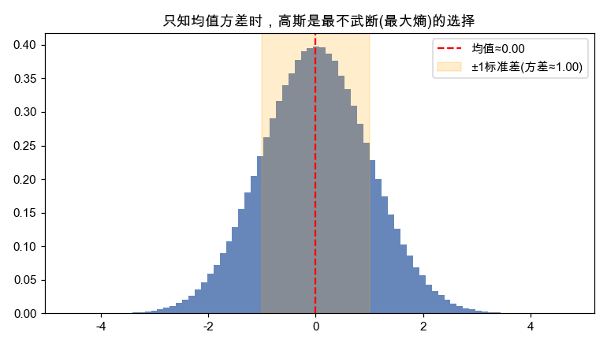

### 4.3 理由三：数学上太好算，梯度下降的好朋友

高斯取对数后，指数项消失，**负对数似然就是一个干净的平方**——
这正是 MSE！光滑、处处可导、梯度简单，对反向传播极其友好：

```python
import torch

import matplotlib.pyplot as plt

data = torch.tensor([1.0, -0.5, 0.3])
# 扫一遍不同的中心 mu，画出"负对数似然"长什么样
mus = torch.linspace(-3, 3, 200)
nll = torch.stack([-torch.distributions.Normal(m, 1.0).log_prob(data).sum() for m in mus])

plt.figure(figsize=(7, 4))
plt.plot(mus.numpy(), nll.numpy(), "b-", lw=2, label="高斯负对数似然(就是个平方碗)")
plt.annotate("梯度永远指向谷底", xy=(data.mean().item(), nll.min().item()),
             xytext=(1.2, nll.max().item()*0.6), arrowprops=dict(arrowstyle="->", color="r"))
plt.title("高斯取对数 → 干净平方碗 → 梯度光滑好算(这就是 MSE)"); plt.legend(); plt.show()
# 这条曲线就是一个光滑的碗，处处可导、谷底唯一 —— 反向传播最爱
```

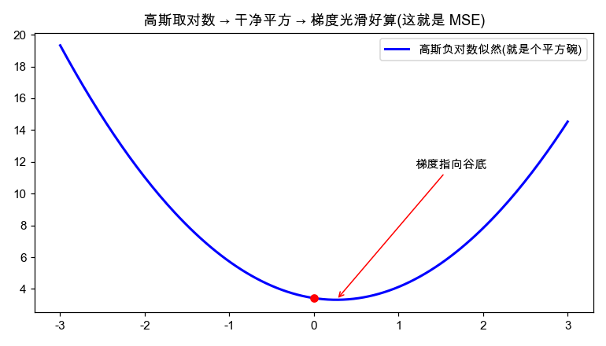

**三条理由合起来：高斯既贴近现实（中心极限）、又最诚实（最大熵）、还最好算（平方梯度）。**
天时地利人和，它不火谁火。

### 4.4 但高斯不是万能：噪声有离群点时它就翻车

高斯假设"极端值几乎不可能"，所以一旦数据里有离群点，它会被带跑偏。
这时候该换分布——比如重尾的拉普拉斯（对应 L1 损失）：

```python
import torch

import matplotlib.pyplot as plt

clean = torch.randn(100)
data = torch.cat([clean, torch.tensor([50.0])])   # 混进一个离群点

plt.figure(figsize=(8, 4))
plt.scatter(data.numpy(), torch.zeros_like(data).numpy(), s=20, alpha=0.5, label="数据点")
plt.axvline(data.mean().item(), color="r", lw=2, label=f"均值/高斯(MSE)={data.mean():.1f} 被带跑")
plt.axvline(data.median().item(), color="g", lw=2, label=f"中位数/拉普拉斯(L1)={data.median():.2f} 稳如老狗")
plt.title("有离群点(50)时：高斯翻车，重尾分布更稳"); plt.legend(); plt.show()
# 一个离群点就把红线(均值)拽到老远，绿线(中位数)纹丝不动
```

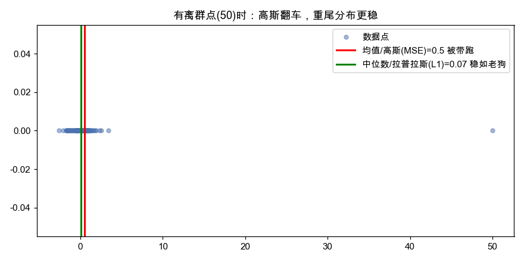

**选哪个分布，本质是在回答"我认为噪声长什么样"。** 高斯是默认值，不是标准答案。

---

## 5. 疑惑点三：生活里哪些事该用哪个分布？

概率分布不是考试道具，它们各自对应一类真实问题。挑最常用的四个，每个配一段能跑的预测代码。

### 5.1 泊松分布：预测"单位时间内发生多少次"——流量、订单、来电

**什么时候用**：你关心"一段时间里某件随机事件发生了几次"，
且每次发生互相独立、平均速率稳定。比如：网站每分钟的访问数、
餐厅每小时的订单数、呼叫中心每分钟的来电数、路口每分钟过几辆车。

```python
import torch

import matplotlib.pyplot as plt

# 假设历史数据显示：某网站平均每分钟有 8 次访问
traffic = torch.distributions.Poisson(rate=8.0)

fig, ax = plt.subplots(1, 2, figsize=(11, 3.8))
ax[0].bar(range(1, 11), traffic.sample((10,)).numpy())     # 预测未来 10 分钟
ax[0].set_title("未来10分钟每分钟访问量预测"); ax[0].set_xlabel("第几分钟")

sims = traffic.sample((1_000_000,))                         # 关键业务问题：超 15 次的概率
ax[1].hist(sims.numpy(), bins=range(0, 25), align="left", rwidth=0.85)
ax[1].axvspan(15, 25, color="red", alpha=0.15,
              label=f">15(可能压垮): {(sims>15).float().mean()*100:.1f}%")
ax[1].set_title("单分钟访问量分布(红区=扩容预警)"); ax[1].legend()
plt.tight_layout(); plt.show()
# 红区比例就能拿去决定"要不要提前扩容" —— 泊松直接对接容量规划
```

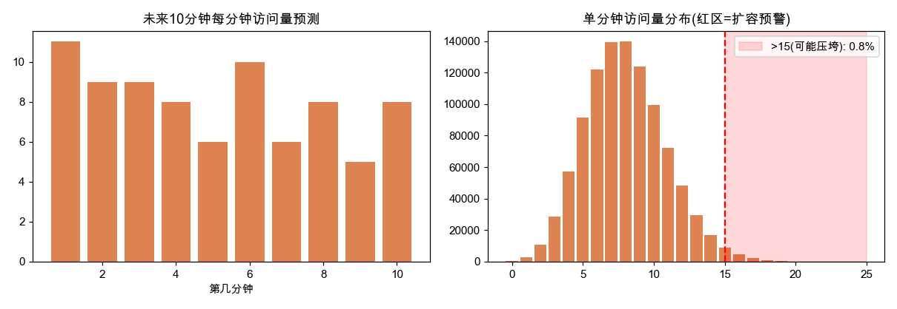

> 泊松的招牌特征：**均值和方差相等**。如果你的流量数据方差远大于均值（忽高忽低），
> 说明事件不独立（比如被热点带飞），这时要换"负二项分布"。分布选错，预测就偏。

### 5.2 伯努利 / 二项分布：预测"会不会发生"——点击、转化、违约

**什么时候用**：结果只有两种（是/否、点/不点、还钱/赖账）。
单次用伯努利，多次累加用二项分布。广告点击率、贷款违约率、AB 测试转化率全是它。

```python
import torch

import matplotlib.pyplot as plt

# 模型预测某用户点击广告的概率是 0.3；给 1000 个同类用户投，预计总点击数的分布
campaign = torch.distributions.Binomial(total_count=1000, probs=0.3)
totals = campaign.sample((10_000,))

plt.figure(figsize=(7, 4))
plt.hist(totals.numpy(), bins=40)
plt.axvspan(280, 320, color="orange", alpha=0.3,
            label=f"落在[280,320]: {((totals>=280)&(totals<=320)).float().mean()*100:.0f}%")
plt.axvline(totals.mean().item(), color="r", ls="--", label=f"均值≈{totals.mean():.0f}")
plt.title("1000 次投放总点击数分布(二项分布→估算ROI)"); plt.legend(); plt.show()
# 总点击数稳稳围着 300 抖 —— 广告主据此估算 ROI 和预算
```

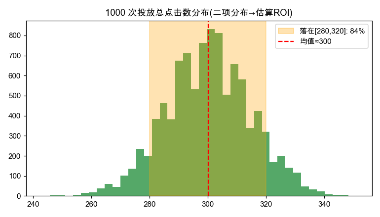

### 5.3 指数分布：预测"还要等多久"——故障间隔、排队、用户流失

**什么时候用**：你关心"距离下一次事件发生还要等多长时间"。
它和泊松是一对：泊松数"次数"，指数量"间隔"。
设备多久坏一次、用户下次打开 App 隔多久、排队要等几分钟。

```python
import torch

import matplotlib.pyplot as plt

# 某服务器平均每 100 小时坏一次 -> 速率 rate = 1/100
failure = torch.distributions.Exponential(rate=1.0 / 100.0)
sims = failure.sample((1_000_000,))

plt.figure(figsize=(7, 4))
plt.hist(sims.numpy(), bins=80, range=(0, 500), density=True)
plt.axvspan(50, 500, color="green", alpha=0.12,
            label=f"撑过50小时不坏: {(sims>50).float().mean()*100:.0f}%")
plt.title("故障间隔时间分布(指数分布→可靠性/排队)"); plt.legend(); plt.show()
# 短间隔最多、越往后越少 —— 指数分布有反直觉的"无记忆性"
```

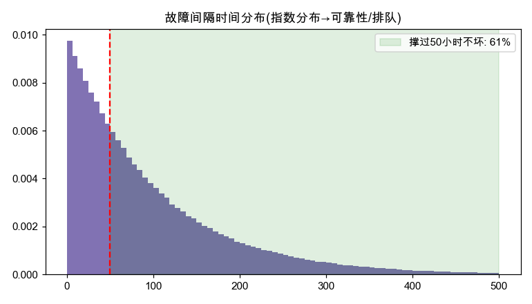

### 5.4 高斯分布：预测"连续的量会落在哪个范围"——身高、温度、股价波动

**什么时候用**：连续的、围绕某个中心上下波动的量。
身高体重、明天气温、测量误差、传感器读数。前面已讲透，这里给个生活化预测：

```python
import torch

import matplotlib.pyplot as plt

# 某地 6 月气温历史：均值 28°C，标准差 3°C
weather = torch.distributions.Normal(loc=28.0, scale=3.0)
sims = weather.sample((1_000_000,))

plt.figure(figsize=(7, 4))
plt.hist(sims.numpy(), bins=80, density=True)
plt.axvspan(35, sims.max().item(), color="red", alpha=0.2,
            label=f"高温>35°C预警: {(sims>35).float().mean()*100:.1f}%")
plt.title("6月气温分布(高斯→连续量落在哪个范围)"); plt.legend(); plt.show()
```

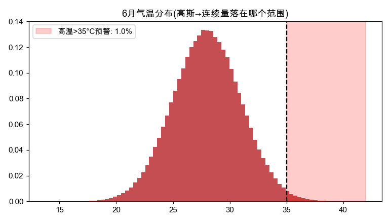

### 5.5 一张速查表：看到问题就知道用哪台机器

| 你的问题长这样 | 该用的分布 | 一句话特征 | 生活例子 |
|---|---|---|---|
| 单位时间发生**几次**？ | 泊松 | 计数、非负整数、均值=方差 | 每分钟访问量、每小时订单 |
| 会**不会**发生？(二选一) | 伯努利 / 二项 | 只有 0/1，多次相加 | 点击率、违约率、转化率 |
| 还要**等多久**？ | 指数 | 正的等待时间、无记忆 | 故障间隔、排队时长 |
| 连续量落在**哪个范围**？ | 高斯 | 钟形、围着中心抖 | 身高、气温、测量误差 |
| 在**几个选项**里选一个？ | 类别(Categorical) | softmax 出来那组概率 | 分类、下一个词预测 |

**选分布的本质，是先看清"你的数据是什么形状的随机"，再挑一台脾气匹配的机器。**

---

## 6. 把一切缝起来：用代码训练一台"会掷骰子的机器"

前面说"网络输出的是分布的旋钮"。现在把这句话变成能跑的训练循环——
不再用 MSE，而是**直接让网络输出高斯的旋钮，最大化真实数据的似然**。
你会看到它和 MSE 殊途同归，但视角更本质：

```python
import torch
import torch.nn as nn

torch.manual_seed(0)
x = torch.linspace(-3, 3, 200).unsqueeze(1)
y = torch.sin(x) + torch.randn(200, 1) * 0.3      # 信号 + 高斯噪声

# 网络输出高斯的中心 mu（旋钮），方差先固定为 1
net = nn.Sequential(nn.Linear(1, 32), nn.ReLU(), nn.Linear(32, 1))
opt = torch.optim.Adam(net.parameters(), lr=0.01)

for epoch in range(2000):
    mu = net(x)
    dist = torch.distributions.Normal(mu, 1.0)    # 为每个 x 造一台高斯机器
    loss = -dist.log_prob(y).mean()               # 让真实 y 最可能被掷出来(最大似然)
    opt.zero_grad(); loss.backward(); opt.step()

# 训练完，每个 x 都有一台机器，画出它学到的中心 + 脾气(±1标准差)
import matplotlib.pyplot as plt
with torch.no_grad():
    pred = net(x)
plt.figure(figsize=(7.5, 4))
plt.scatter(x.numpy(), y.numpy(), s=10, alpha=0.4, label="真实数据(带高斯噪声)")
plt.plot(x.numpy(), pred.numpy(), "r-", lw=2.5, label="网络学到的高斯中心 mu")
plt.fill_between(x.flatten().numpy(), (pred-1).flatten().numpy(), (pred+1).flatten().numpy(),
                 color="red", alpha=0.12, label="±1 标准差(机器的脾气)")
plt.title("用最大似然训练：让真实数据最可能被掷出来"); plt.legend(); plt.show()
```

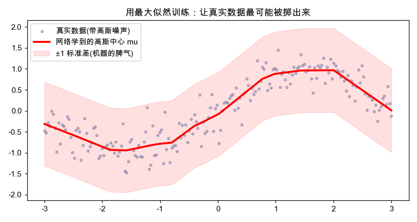

把这段和开头第 0 节的三行主线对照，每一步都对上了：

```python
for epoch in range(epochs):
    mu   = net(x)                          # ① 网络算出分布的旋钮
    dist = torch.distributions.Normal(mu, 1.0)  # 一台为这个 x 定制的掷骰子机器
    loss = -dist.log_prob(y).mean()        # ③ 似然：真实数据有多"正常"
    opt.zero_grad(); loss.backward(); opt.step()  # 拧旋钮，让数据更"正常"
```

> 进阶玩法：让网络**同时输出 mu 和 sigma**（两个旋钮），它就能学会
> "在哪个区域我更没把握"——这就是不确定性估计，自动驾驶、医疗 AI 的刚需。
> 一旦你把网络看成"分布生成器"，这些高级能力都是自然延伸。

---

## 7. 终极视角：现代生成式 AI，全是"高级掷骰子机器"

最后拔高一层。你以为大模型在"思考"，其实它每吐一个字，都是在**掷一台多面骰子**：

```python
import torch

import matplotlib.pyplot as plt

# 模拟大模型预测"下一个词"：词表里每个词一个分数，softmax 成骰子，再掷
vocab = ["猫", "狗", "天气", "今天", "很好"]
logits = torch.tensor([1.0, 0.5, 2.0, 3.0, 0.2])     # 模型算出的原始分数
probs = torch.softmax(logits, dim=0)                  # 一台 5 面骰子的旋钮

plt.figure(figsize=(7, 4))
plt.bar(vocab, probs.numpy())
for i, v in enumerate(probs):
    plt.text(i, v + 0.005, f"{v:.2f}", ha="center")
plt.title("大模型每吐一个字 = 在词表上掷一台多面骰子"); plt.show()
# "今天"概率最高但不是 100% —— 所以大模型每次回答都不太一样
# "温度(temperature)"参数，调的就是这台骰子的"随机程度"
```

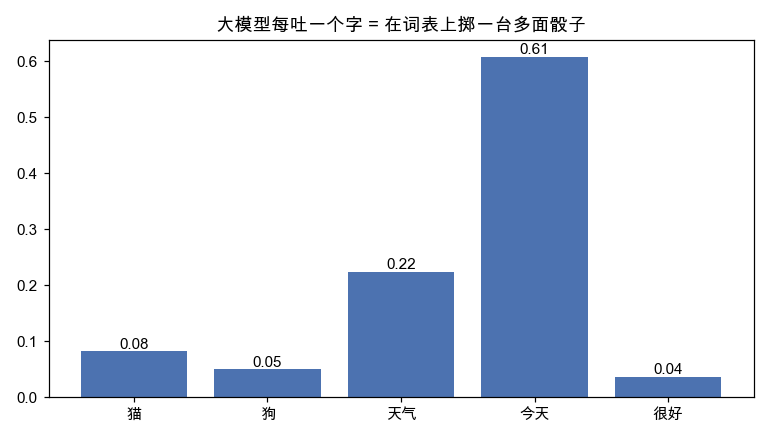

- **大语言模型**：每一步在词表上掷一台多面骰子（Categorical）。
- **扩散模型 / 图像生成**：从一堆高斯噪声出发，一步步"去噪"还原成图。
- **VAE**：在一个高斯隐空间里采样，再解码成数据。

> 这一切都呼应第 3 节的同分布假设：大模型只能生成"像训练语料分布"的东西。
> 它没读过的领域照样会胡说（幻觉），本质还是 OOD。

**整个现代 AI，从一行线性回归到千亿参数大模型，骨子里都是同一句话：
学一台会掷骰子的机器，让它掷出来的世界，像真实的世界。**

---

## 8. 五个最该记住的"看见概率"的画面

| 概念 | 别再背公式，记住这个画面 | 对应章节 |
|---|---|---|
| **分布** | 一台带旋钮的掷骰子机器，采样才是它的本体 | 第 1 节 |
| **网络的输出** | 不是答案，是一台定制机器的旋钮 | 第 2 节 |
| **同分布假设** | 训练和预测得用同一台出题机器，换了就崩 | 第 3、9 节 |
| **高斯为王** | 小因素一加就成钟形、最诚实、最好算 | 第 4 节 |
| **选分布** | 先看你的随机是什么形状，再挑匹配的机器 | 第 5 节 |
| **概率就是面积** | 高度不是概率，曲线下那块面积才是；总面积恒为 1 | 第 10 节 |

两个最该"在脑子里看见"的画面：

- **机器学习 = 用一把样本逼近整台机器** —— 西瓜书的地基：样本是从未知分布里独立同分布抽出来的，
  i.i.d. 是"用有限样本估计整体"这件事能成立的唯一保证（第 9 节）。
- **概率就是面积** —— 概率密度画出来是条曲线，曲线的**高度**不是概率，
  下方那块**面积**才是；总面积恒为 1，期望是这块面积的重心（第 10 节）。

### 一句话总结这趟旅程

> 概率论的课本从"密度公式"讲起，所以你学完只剩公式（第 1 节）；
> 换成从"掷骰子机器"讲起，你就懂了神经网络的输出其实是机器的旋钮（第 2 节）；
> 懂了这点，就明白 AI 为什么离不开同分布、一换分布就翻车（第 3 节）；
> 也明白高斯凭什么称王、什么时候该换别的机器（第 4、5 节）；
> 最后你会看见：从线性回归到 ChatGPT，全都是在**调一台会掷骰子的机器**（第 6、7 节）。

---

## 9. 深入：西瓜书为什么说"机器学习就是同分布下的预测"

> 这一节专门把第 3 节那句"AI 依赖同分布"升级成一个你能**在代码里看见**的地基。
> 西瓜书反复强调的一句话是：**样本独立同分布（i.i.d.）地采自某个未知分布 D。**
> 听起来像废话，其实它是整个统计学习能成立的**唯一支柱**——抽掉它，学习就坍塌成算命。

### 9.1 学习的真正目标：不是背样本，是逼近整台机器

把第 1 节的画面接过来：真实世界是一台**未知的掷骰子机器 D**，你永远看不到它的旋钮。
你能做的，只是**让它掷几把**（采集训练数据），然后反推"这台机器大概长什么样"。

```python
import torch

import matplotlib.pyplot as plt

# 上帝视角：真实世界其实是这台机器(我们假装不知道它的参数)
true_world = torch.distributions.Normal(loc=3.0, scale=2.0)
big = true_world.sample((1_000_000,))     # 整台机器(上帝才看得到)
sample = true_world.sample((100,))        # 我们能拿到的，只是它漏出的 100 个样本

plt.figure(figsize=(7.5, 4))
plt.hist(big.numpy(), bins=80, density=True, color="#cccccc", label="真实机器(看不见)")
plt.scatter(sample.numpy(), torch.rand(100).numpy()*0.02, s=12, color="#C44E52", label="我们看到的100个样本")
plt.axvline(3.0, color="k", ls="--", label="真实中心=3.0")
plt.axvline(sample.mean().item(), color="r", label=f"样本估计={sample.mean():.2f}")
plt.title("训练数据只是未知机器漏出的几滴水"); plt.legend(fontsize=8); plt.show()
# 学习 = 用这把样本(红点)，去猜那台我们看不见的机器(灰色)的旋钮
```

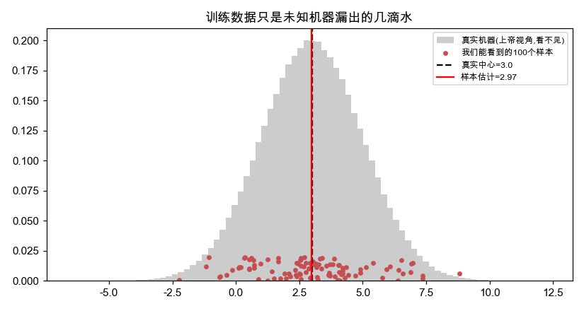

**训练数据不是目标，它只是那台未知机器漏出来的几滴水。** 学习是透过这几滴水去还原整条河。

### 9.2 i.i.d. 凭什么成立：大数定律

凭什么"几滴水能还原整条河"？靠的是概率论第一块基石——**大数定律**：
只要样本是独立同分布抽的，**样本越多，用样本算出来的统计量就越逼近真实机器的旋钮。**
亲眼看着它收敛：

```python
import torch

import matplotlib.pyplot as plt

torch.manual_seed(0)
true_world = torch.distributions.Normal(3.0, 2.0)   # 真实中心 = 3.0

ns = torch.logspace(1, 6, 60).long()                # 样本数从 10 到 100 万
ests = [true_world.sample((int(n),)).mean().item() for n in ns]

plt.figure(figsize=(7.5, 4))
plt.semilogx(ns.numpy(), ests, "o-", ms=4, label="样本均值估计")
plt.axhline(3.0, color="r", ls="--", label="真实中心=3.0")
plt.title("大数定律：样本越多，估计越咬死真值"); plt.xlabel("样本数 n (对数轴)"); plt.legend(); plt.show()
# 左边(样本少)上下乱跳，越往右越死死贴住 3.0 —— 这就是 i.i.d. 给的承诺
```

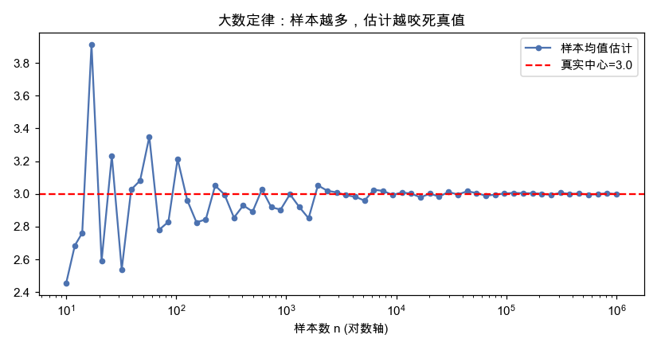

**这个收敛，就是"用有限样本预测整体"在数学上唯一的底气。**
独立——保证每滴水都带来新信息；同分布——保证它们说的是同一条河。少一条都不行。

### 9.3 经验误差 vs 泛化误差：i.i.d. 是连接它们的桥

西瓜书第二章的核心区分：**经验误差**（在训练集上的误差）和**泛化误差**（在整个分布 D 上的误差）。
我们能算的只有前者，真正想要的却是后者。i.i.d. 假设保证：**样本足够多时，经验误差会逼近泛化误差。**
代码量化这道"鸿沟"如何随数据增多而收窄：

```python
import torch
import torch.nn as nn

import matplotlib.pyplot as plt

torch.manual_seed(0)
def draw(n):                                  # 从同一台机器抽 n 个样本
    x = (torch.rand(n, 1) - 0.5) * 6
    return x, torch.sin(x) + torch.randn(n, 1) * 0.1

res = {}
for n in [15, 200]:
    x_tr, y_tr = draw(n)
    net = nn.Sequential(nn.Linear(1, 64), nn.ReLU(),
                        nn.Linear(64, 64), nn.ReLU(), nn.Linear(64, 1))
    opt = torch.optim.Adam(net.parameters(), lr=0.01)
    for _ in range(3000):
        loss = ((net(x_tr) - y_tr) ** 2).mean()
        opt.zero_grad(); loss.backward(); opt.step()
    x_te, y_te = draw(5000)                    # 海量新样本 ≈ 整个分布 D
    res[n] = (((net(x_tr)-y_tr)**2).mean().item(), ((net(x_te)-y_te)**2).mean().item())

plt.figure(figsize=(7, 4))
labels = ["n=15 (样本少)", "n=200 (样本多)"]
xpos = range(len(labels))
plt.bar([p-0.2 for p in xpos], [res[15][0], res[200][0]], width=0.4, label="经验误差(训练集)")
plt.bar([p+0.2 for p in xpos], [res[15][1], res[200][1]], width=0.4, label="泛化误差(新数据)")
plt.xticks(list(xpos), labels)
plt.title("样本越多，经验误差越能代表真实水平(鸿沟收窄)"); plt.legend(); plt.show()
# n=15 时经验误差≈0 却泛化差(鸿沟宽)；n=200 时两根柱子几乎一样高
```

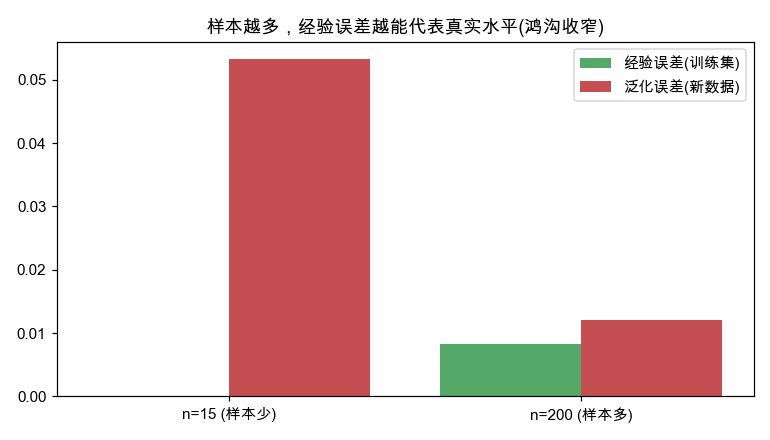

这就是上一篇《从线性到非线性》第 7 节过拟合的另一面：**样本太少时，
经验误差是个骗人的好成绩；i.i.d. + 足够多的样本，才让训练表现可信地推广到未来。**

### 9.4 没有免费的午餐：连"同分布"都不给，就没有学习

最后一块拼图——西瓜书也讲的**没有免费午餐定理（NFL）**：
**如果不对数据做任何分布假设，那么所有算法的平均表现完全一样（都等于瞎猜）。**
换句话说，"同分布"不是可有可无的技术细节，它是让学习区别于算命的**前提本身**。

```python
import torch

import matplotlib.pyplot as plt

torch.manual_seed(0)
# 一个【没有任何规律】的世界：标签纯随机，和输入毫无关系
# 重复 200 次"训练+预测"，看准确率落在哪
accs = [(torch.randint(0,2,(1000,)) == torch.randint(0,2,(1000,))).float().mean().item()
        for _ in range(200)]

plt.figure(figsize=(7, 4))
plt.hist(accs, bins=25)
plt.axvline(0.5, color="r", ls="--", lw=2, label="永远围着 50%(瞎猜)")
plt.title("无规律世界(NFL)：再强的模型也只能瞎猜"); plt.xlabel("准确率"); plt.legend(); plt.show()
# 准确率死死卡在 0.5 附近 —— 没有可复现的分布结构，网络变不出信息
```

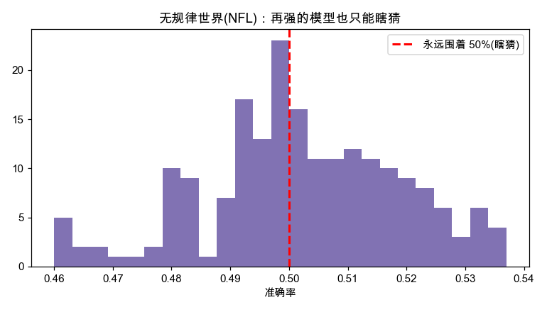

**一句话收口：机器学习能work，不是因为模型聪明，而是因为我们赌对了"世界是同一台稳定的机器"。**
这个赌注的名字，就叫独立同分布。

---

## 10. 深入：概率就是面积

> 这一节把全文的"掷骰子机器"和一个更基础的画面焊死：**概率 = 面积。**
> 一旦你把概率看成"密度曲线下方那块区域的大小"，
> 第 1 节的密度、第 4 节的高斯、第 6 节的似然，会瞬间串成一条线。
> （这也是上一篇《从线性到非线性》第 10 节反复敲的那句话，这里换个角度再钉一遍。）

### 10.1 核心翻转：高度不是概率，面积才是

第 1 节我们画过钟形曲线，但有个致命误解必须破除：**曲线的高度不是概率。**
对连续分布，问"恰好取到某一个值的概率"，答案永远是 **0**——因为一条线没有面积。
真正的概率，是曲线下方**某一段的面积**。代码先证明"单点概率为 0"这件反直觉的事：

```python
import torch, math
import matplotlib.pyplot as plt

samples = torch.distributions.Normal(0.0, 1.0).sample((10_000_000,))
n_point = (samples == 0.5).sum().item()                           # 恰好=0.5 的个数
n_band  = ((samples > 0.49) & (samples < 0.51)).sum().item()      # 0.5 附近一小段

xs = torch.linspace(-4, 4, 400)
plt.figure(figsize=(7, 4))
plt.plot(xs.numpy(), (torch.exp(-xs**2/2)/math.sqrt(2*math.pi)).numpy(), "b-", lw=2)
plt.axvline(0.5, color="r", lw=1.5, label=f"单个点(宽度0)→个数={n_point}→概率0")
plt.fill_between([0.49, 0.51], [0, 0], [0.36, 0.36], color="orange", alpha=0.6,
                 label=f"给它一点宽度→个数={n_band}→才有面积")
plt.title("高度不是概率：单个点抓不到任何概率"); plt.legend(); plt.show()
```

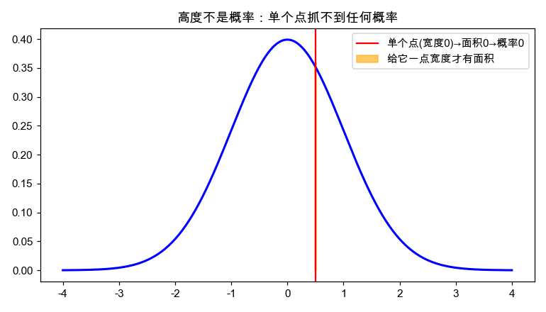

### 10.2 把面积算出来：密度 × 宽度，加起来

那"密度高度"有什么用？**高度 × 宽度 = 小块面积**，把无数小块加起来就是概率（这正是积分）。
先验证整条高斯曲线下的总面积是 1——也就是"掷出来的数必然是某个值"：

```python
import torch, math

import matplotlib.pyplot as plt

def gaussian_height(x, mu=0.0, sigma=1.0):       # 密度 = 曲线的"高度"
    return torch.exp(-(x - mu) ** 2 / (2 * sigma ** 2)) / (sigma * math.sqrt(2 * math.pi))

xs = torch.linspace(-4, 4, 400)
hs = gaussian_height(xs)
mask = (xs > -1) & (xs < 1)
seg_area = (gaussian_height(torch.linspace(-1, 1, 100_000)) * (2/100_000)).sum()

plt.figure(figsize=(7, 4))
plt.plot(xs.numpy(), hs.numpy(), "b-", lw=2)
plt.fill_between(xs.numpy(), hs.numpy(), where=mask.numpy(), alpha=0.5,
                 label=f"[-1,1]的面积≈{seg_area:.2f}")
plt.title("落在某区间的概率 = 那一段的面积(著名的68%)"); plt.legend(); plt.show()
# 整条曲线下总面积=1；中间这块阴影=0.68，就是"1个标准差68%"
```

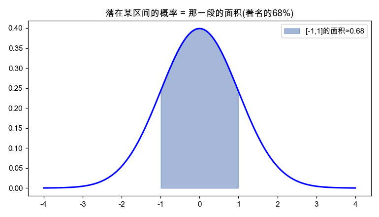

**总面积 = 1，就是"所有可能性加起来必然发生其一"的几何含义。** 那个著名的"1 个标准差 ≈ 68%"，
不过是钟形曲线中间那段面积的大小，毫无神秘可言。

### 10.3 采样 = 往面积里撒点：两个视角是同一件事

这里把第 1 节的"采样"和本节的"面积"彻底画上等号：
**让机器掷一百万把，落在某区间的样本比例，正好等于那块面积。**
密度（脾气说明书）和采样（实际掷骰子），原来量的是同一块面积：

```python
import torch, math
import matplotlib.pyplot as plt

samples = torch.distributions.Normal(0.0, 1.0).sample((1_000_000,))
ratio = ((samples > -1) & (samples < 1)).float().mean()

xs = torch.linspace(-4, 4, 400); mask = (xs > -1) & (xs < 1)
hs = torch.exp(-xs**2/2)/math.sqrt(2*math.pi)
plt.figure(figsize=(7, 4))
plt.hist(samples.numpy(), bins=80, density=True, color="#cccccc", label="掷100万把的频率")
plt.plot(xs.numpy(), hs.numpy(), "b-", lw=2, label="密度曲线")
plt.fill_between(xs.numpy(), hs.numpy(), where=mask.numpy(), alpha=0.4,
                 label=f"落在[-1,1]比例={ratio:.2f}")
plt.title("采样=往面积里撒点：撒点比例 = 积分面积"); plt.legend(fontsize=8); plt.show()
# 用"撒点数比例"量出的 0.68，和 10.2 用"积分"算的面积一模一样 —— 殊途同归
```

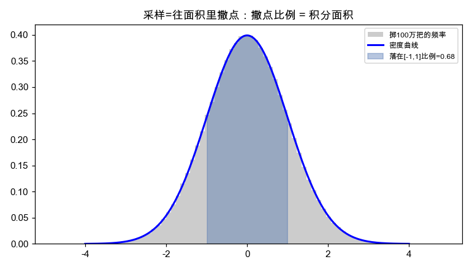

这就是**蒙特卡洛**的全部精神：积不动的面积，就往里扔点数比例。
深度学习里的随机采样、Dropout、扩散模型去噪、强化学习采样，骨子里都是"扔飞镖估面积"。

### 10.4 期望 = 面积的重心

第 2 节说"网络学的是分布的中心"。这个中心（期望）是什么？
**是用面积给每个取值加权后的平均位置，也就是整块面积的重心。**

```python
import torch

import matplotlib.pyplot as plt

# 一个作弊骰子：6 点特别容易出
values = [1, 2, 3, 4, 5, 6]
probs  = [0.1, 0.1, 0.1, 0.1, 0.1, 0.5]   # 每个面分到的"面积"，和=1
expectation = sum(v*p for v, p in zip(values, probs))

plt.figure(figsize=(7, 4))
plt.bar(values, probs, width=0.6)
plt.axvline(expectation, color="r", lw=2.5, label=f"期望(重心)={expectation}")
plt.axvline(3.5, color="gray", ls="--", label="若均匀则重心=3.5")
plt.title("期望 = 用面积加权的平均位置(被6拽过去)"); plt.xlabel("骰子点数"); plt.legend(); plt.show()
# 因为 6 那根柱子最高(面积最大)，重心被它从 3.5 拽到了 4.6
```

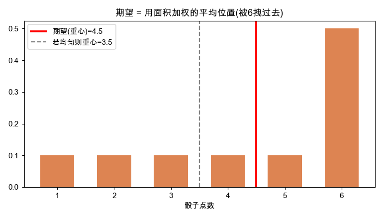

**期望 = Σ(取值 × 它那块面积)。** 回归网络输出的那个 `mu`，学的就是这个重心位置——
这也正是第 6 节里 `Normal(mu, 1.0)` 的 `mu` 想拟合的东西。

### 10.5 回到似然：训练就是"把真实数据的面积顶到最高"

最后把面积焊回第 6 节的训练。`log_prob(y)` 取的就是**真实数据 y 处那条曲线的高度**。
最大似然 = 拧旋钮，让所有真实数据点**踩在尽量高的位置**（高度乘积最大）。
扫一遍不同的中心 `mu`，看哪个让真实数据"站得最高"：

```python
import torch

import matplotlib.pyplot as plt

torch.manual_seed(0)
data = 3.0 + torch.randn(2000) * 1.0              # 真实数据围绕 3.0 抖动

mus = torch.linspace(0, 6, 601)
tot = torch.stack([torch.distributions.Normal(m, 1.0).log_prob(data).sum() for m in mus])
best_mu = mus[tot.argmax()]

plt.figure(figsize=(7, 4))
plt.plot(mus.numpy(), tot.numpy(), "b-", lw=2, label="真实数据处的总(对数)高度")
plt.axvline(best_mu.item(), color="r", ls="--", label=f"最高点 mu={best_mu:.2f}")
plt.axvline(data.mean().item(), color="g", ls=":", label=f"数据均值={data.mean():.2f}")
plt.title("最大似然:让真实数据踩在最高面积处 = 最小化MSE"); plt.legend(fontsize=8); plt.show()
# 红虚线(让数据站最高的mu) 和 绿点线(数据均值) 完全重合 —— 同一件事
```

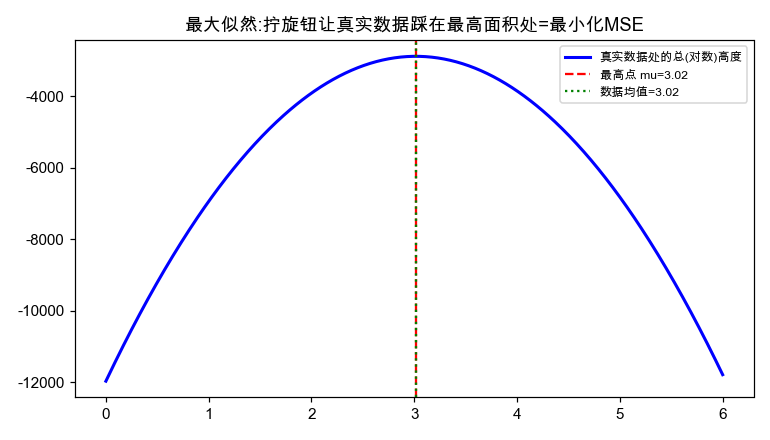

**这就闭环了**：网络输出旋钮（第 2 节）→ 旋钮定义一台机器（第 1 节）→
训练就是移动曲线、让真实数据踩在最高的面积上（本节）→ 而这恰好等价于最小化 MSE（第 4、6 节）。
概率论里看似无关的密度、期望、似然、损失函数，全被"面积"这一个词串了起来。

---

## 附：本文出现的分布与它们的 PyTorch 接口

| 分布 | PyTorch 类 | 旋钮(参数) | 掷出来是什么 |
|---|---|---|---|
| 高斯 | `Normal(loc, scale)` | 中心、宽窄 | 连续实数，钟形 |
| 泊松 | `Poisson(rate)` | 平均速率 | 非负整数(次数) |
| 伯努利 | `Bernoulli(probs)` | 成功概率 | 0 或 1 |
| 二项 | `Binomial(n, probs)` | 次数、成功概率 | 0~n 的整数(总成功数) |
| 指数 | `Exponential(rate)` | 速率 | 正实数(等待时间) |
| 类别 | `Categorical(probs/logits)` | 各面概率 | 类别编号 |

所有这些机器，都支持同样两个动作：`.sample()`（掷一把）和 `.log_prob(x)`（这个值有多正常）。
**学会这两个动作，你就握住了用概率做预测的全部钥匙。**
